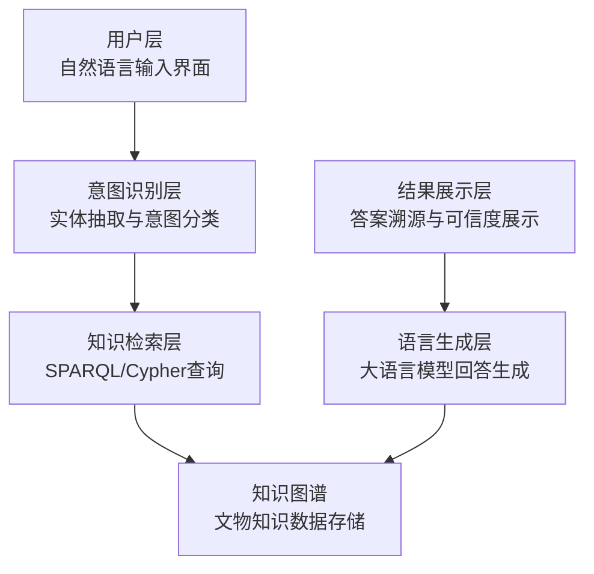
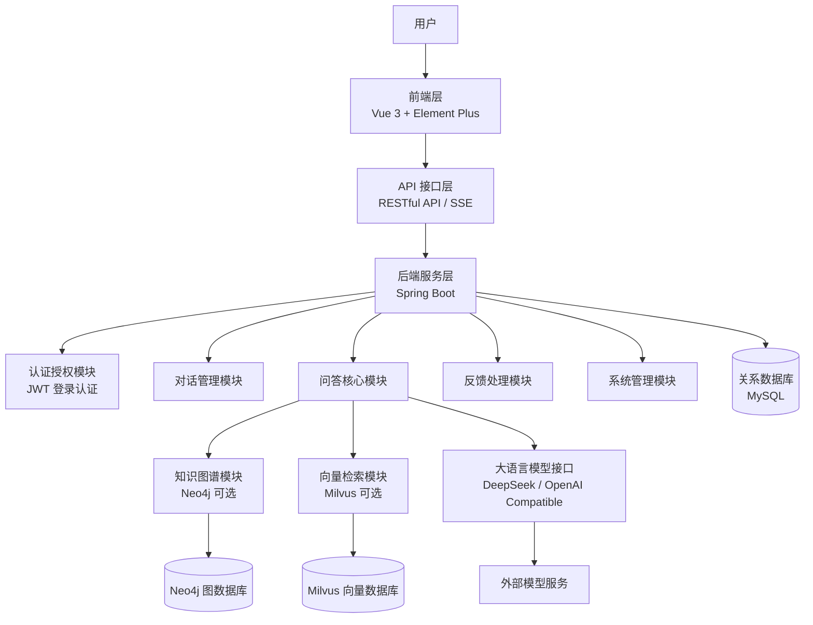
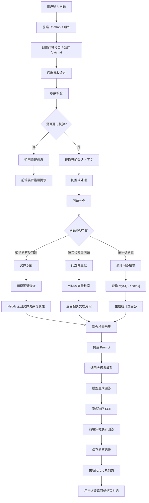
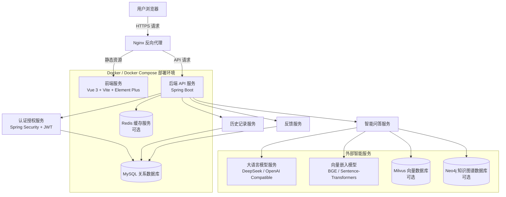

# 海外藏中国文物知识管理与服务平台——文博智问子系统 设计文档

## 1. 引言

### 1.1 文档目的

本文档用于描述知识问答子系统的总体架构、模块划分、接口设计、数据库设计、安全设计、部署方案和测试策略，为系统开发、运维和后续扩展提供技术依据。

### 1.2 系统概述
“文博智问”知识问答子系统是海外藏中国文物知识管理与服务平台的重要组成部分，是一个面向海外藏中国文物领域的智能知识问答系统。系统以前端 Vue 3、后端 Spring Boot、关系型数据库 MySQL 为基础，结合知识图谱、向量检索和大语言模型技术，能够接收用户自然语言问题，自动识别问题意图，检索相关文物知识、历史背景、馆藏信息和文献资料，并生成结构清晰、来源可追溯的智能回答。

系统支持多轮对话、历史记录管理、答案来源展示、用户反馈纠错等功能，旨在提升用户获取海外藏中国文物知识的效率，为研究人员、文博工作者、普通用户和平台管理人员提供智能化知识服务。

### 1.3 目标读者

- 前端开发人员
- 后端开发人员
- 算法工程师
- 测试工程师
- 运维人员
- 项目管理人员
- 文物知识专家

### 1.4 术语与缩略语

| 术语 | 全称 | 描述 |
|---|---|---|
| RAG | Retrieval-Augmented Generation | 检索增强生成，通过检索相关知识增强大语言模型回答质量的技术 |
| LLM | Large Language Model | 大语言模型，如ChatGPT等 |
| KG | Knowledge Graph | 知识图谱，描述实体及其关系的语义网络 |
| JWT | JSON Web Token | 基于JSON的开放标准，用于在网络应用间传递声明的令牌 |

### 1.5 参考文献

1. Vue.js 官方文档. Vue 3 Documentation. https://vuejs.org/
2. Spring Boot 官方文档. Spring Boot Reference Documentation. https://spring.io/projects/spring-boot
3. Spring Security 官方文档. Spring Security Reference Documentation. https://spring.io/projects/spring-security
4. MySQL 官方文档. MySQL 8.0 Reference Manual. https://dev.mysql.com/doc/refman/8.0/en/
5. Neo4j 官方文档. Neo4j Graph Database Documentation. https://neo4j.com/docs/
6. Milvus 官方文档. Milvus Vector Database Documentation. https://milvus.io/docs
7. Docker 官方文档. Docker Documentation. https://docs.docker.com/
8. Nginx 官方文档. NGINX Documentation. https://nginx.org/en/docs/
---

## 2. 系统架构设计

### 2.1 架构风格

“文博智问”知识问答子系统采用前后端分离的分层架构，前端基于 Vue 3 构建交互界面，后端基于 Spring Boot 
提供 RESTful API 和流式问答服务，数据库采用 MySQL 存储用户信息、会话记录、问答历史和反馈数据。
同时，系统可结合 Neo4j 知识图谱、Milvus 向量数据库以及大语言模型服务，实现面向文物知识的智能检索增强问答。

- 前端层：基于 Vue 3、Element Plus 构建用户交互界面，负责登录注册、对话展示、历史记录管理、流式答案显示等功能。
- API 接口层：基于 RESTful API 和 SSE 流式接口，负责前后端数据交互。
- 后端服务层：基于 Spring Boot 实现用户认证、会话管理、问答处理、反馈管理和系统配置等业务逻辑。
- 业务层：负责问题预处理、意图识别、检索调度、Prompt 构造、模型调用和答案生成。
- 数据层：基于 MySQL 存储用户、会话、消息、反馈等结构化数据。
- 外部服务层：包括大语言模型服务、向量嵌入模型、知识图谱服务和向量检索服务。




### 2.2 总体分层架构图



### 2.3 技术栈

#### 前端技术栈

- 核心框架：Vue 3
- 开发语言：JavaScript / TypeScript
- 状态管理：Pinia
- 路由管理：Vue Router
- UI 组件库：Element Plus
- HTTP 客户端：Axios
- Markdown 渲染：marked / markdown-it
- 代码高亮：highlight.js
- 构建工具：Vite
- 流式响应处理：EventSource / fetch stream
- 样式方案：SCSS / CSS Modules

#### 后端技术栈

- 核心框架：Spring Boot 3.x
- 开发语言：Java
- Web 框架：Spring Web
- ORM 框架：MyBatis-Plus / MyBatis
- 认证授权：Spring Security + JWT
- 参数校验：Hibernate Validator
- 接口文档：Knife4j / Swagger OpenAPI
- 关系数据库：MySQL 8.x
- 数据库连接池：Druid / HikariCP
- 缓存服务：Redis
- 大语言模型：DeepSeek / OpenAI Compatible API
- 向量嵌入：Sentence-Transformers / BGE / text-embedding 模型
- 向量数据库：Milvus
- 图数据库：Neo4j
- 日志框架：SLF4J + Logback
- 构建工具：Maven

#### 部署技术

- 容器化：Docker + Docker Compose
- 反向代理：Nginx
- 环境管理：application.yml 多环境配置
- 日志管理：Docker logs / ELK 
- 服务监控：Spring Boot Actuator 

| 类别 | 技术选型 |
|---|---|
| 前端框架 | Vue.js 3.x |
| 构建工具 | Vite |
| 状态管理 | Pinia |
| 路由管理 | Vue Router |
| UI 组件库 | Element Plus |
| HTTP 客户端 | Axios |
| Markdown 渲染 | marked / markdown-it |
| 后端框架 | Spring Boot 3.x |
| 安全框架 | Spring Security + JWT |
| ORM 框架 | MyBatis-Plus / MyBatis |
| 关系数据库 | MySQL 8.x |
| 缓存数据库 | Redis |
| 图数据库 | Neo4j|
| 向量数据库 | Milvus|
| 大语言模型 | DeepSeek / OpenAI 兼容模型 |
| 向量嵌入 | BGE / Sentence-Transformers / text-embedding |
| 接口文档 | Knife4j / Swagger OpenAPI |
| 部署方式 | Docker、Docker Compose、Nginx |

### 2.4 模块划分

#### 前端模块

- 认证模块：登录、注册、用户状态管理。
- 对话模块：消息输入、消息展示、流式输出。
- 历史记录模块：新建、查询、重命名、删除对话。
- 反馈模块：答案评价、问题反馈。
- 公共组件模块：布局、导航、弹窗、加载状态等。

#### 后端模块

- 认证模块：用户注册、登录、JWT 生成和验证。
- 对话管理模块：对话创建、历史查询、重命名和删除。
- 问答核心模块：问题分类、实体识别、检索调度和答案生成。
- 知识图谱模块：实体查询、关系查询、属性查询。
- 向量检索模块：文本向量化、相似度检索、片段召回。
- 统计问答模块：数量统计、类别统计、机构统计等。
- 模型接口模块：提示词构造、模型调用、流式响应。
- 反馈处理模块：用户反馈记录、纠错建议管理。

---

## 3. 详细设计

### 3.1 模块设计

#### 3.1.1 后端核心模块

##### 认证模块

- 职责：处理用户注册、登录、用户信息获取、JWT 令牌生成与校验等功能。
- 主要组件：
  - `AuthController`：认证相关接口控制器
  - `UserService`：用户业务逻辑处理
  - `JwtUtil`：JWT 生成、解析与校验工具类
  - `SecurityConfig`：Spring Security 安全配置
  - `JwtAuthenticationFilter`：JWT 请求过滤器

##### 用户模块

- 职责：维护用户基础信息，支持用户信息查询、修改和权限扩展。
- 主要组件：
  - `UserController`
  - `UserService`
  - `UserMapper`
  - `UserEntity`

##### 对话管理模块

- 职责：负责新建对话、查询历史对话列表、重命名对话、删除对话等。
- 主要组件：
  - `ConversationController`
  - `ConversationService`
  - `ConversationMapper`
  - `ConversationEntity`

##### 问答核心模块

- 职责：接收用户问题，完成问题预处理、意图识别、知识检索、模型调用和答案生成。
- 主要组件：
  - `QaController`
  - `QaService`
  - `QuestionAnalyzeService`
  - `RetrievalService`
  - `PromptService`
  - `LlmService`

##### RAG 检索增强模块

- 职责：将用户问题转化为检索请求，从知识库、向量库和图谱中召回相关内容，并组织为上下文。
- 主要组件：
  - `EmbeddingService`
  - `VectorSearchService`
  - `KnowledgeGraphService`
  - `HybridRetrievalService`

##### 反馈处理模块

- 职责：记录用户对回答的评价、纠错建议和问题反馈，为后续知识库优化提供依据。
- 主要组件：
  - `FeedbackController`
  - `FeedbackService`
  - `FeedbackMapper`
  - `FeedbackEntity`

##### 流程图：问答处理流程

#### 3.1.2 前端核心模块

##### 对话组件

- 职责：显示对话界面，处理消息发送和接收
- 主要组件：
  - `ChatView.vue`：对话页面
  - `ChatInput.vue`：消息输入组件
  - `ChatMessage.vue`：消息展示组件
  - `ChatHistory.vue`：历史记录组件

##### 状态管理

- 职责：管理全局状态
- 主要组件：
  - `stores/user.js`：用户状态管理
  - `stores/chat.js`：对话状态管理

---

### 3.2 接口设计

## 3.2.1 个人信息相关接口

### 3.2.1.1 用户注册

#### 3.2.1.1.1 基本信息

- 请求路径：`/auth/register`
- 请求方式：`POST`
- 接口描述：该接口用于注册新用户

#### 3.2.1.1.2 请求参数

请求参数格式：`x-www-form-urlencoded`

请求参数说明：

| 参数名称 | 类型 | 是否必须 | 说明 | 备注 |
|---|---|---|---|---|
| username | string | 是 | 用户名 |  |
| email | string | 是 | 邮箱 |  |
| password | string | 是 | 密码 | 5~16位非空字符 |
| repassword | string | 是 | 确认密码 | 5~16位非空字符 |

#### 3.2.1.1.3 响应数据

响应数据类型：`application/json`

响应参数说明：

| 参数名称 | 类型 | 是否必须 | 默认值 | 备注 | 其他信息 |
|---|---|---|---|---|---|
| code | number | 必须 |  | 响应码, 0-成功,1-失败 |  |
| message | string | 非必须 |  | 提示信息 |  |
| data | object | 非必须 |  | 返回的数据 |  |

响应数据样例：

```json
{
  "code": 0,
  "message": "操作成功",
  "data": null
}
```

---

### 3.2.1.2 登录

#### 3.2.1.2.1 基本信息

- 请求路径：`/auth/login`
- 请求方式：`POST`
- 接口描述：该接口用于登录

#### 3.2.1.2.2 请求参数

请求参数格式：`x-www-form-urlencoded`

请求参数说明：

| 参数名称 | 类型 | 说明 | 是否必须 | 备注 |
|---|---|---|---|---|
| username | string | 用户名 | 是 |  |
| password | string | 密码 | 是 | 5~16位非空字符 |

#### 3.2.1.2.3 响应数据

响应数据类型：`application/json`

响应参数说明：

| 名称 | 类型 | 是否必须 | 默认值 | 备注 | 其他信息 |
|---|---|---|---|---|---|
| code | number | 必须 |  | 响应码, 0-成功,1-失败 |  |
| message | string | 非必须 |  | 提示信息 |  |
| data | string | 必须 |  | 返回的数据,jwt令牌 |  |
| \|-userId | number | 必须 |  | 用户ID |  |

响应数据样例：

```json
{
  "code": 0,
  "message": "操作成功",
  "data": "eyJhbGciOiJIUzI1NiIsInR5cCI6IkpXVCJ9.eyJjbGFpbXMiOnsiaWQiOjUsInVzZXJuYW1lIjoid2F uZ2JhIn0sImV4cCI6MTY5MzcxNTk3OH0.pE_RATcoF7Nm9KEp9eC3CzcBbKWAFOL0IsuMNjnZ95M"
}
```

#### 3.2.1.2.4 备注说明

用户登录成功后，系统会自动下发JWT令牌，然后在后续的每次请求中，浏览器都需要在请求头header中携带到服务端，请求头的名称为 `Authorization`，值为登录时下发的JWT令牌。

如果检测到用户未登录，则HTTP响应状态码为 `401`。

---

### 3.2.1.3 获取用户信息

#### 3.2.1.3.1 基本信息

- 请求路径：`/auth/getuserInfo`
- 请求方式：`GET`
- 接口描述：该接口用于获取历史记录详细信息

#### 3.2.1.3.2 请求参数

请求参数格式：`x-www-form-urlencoded`

请求参数说明：无

#### 3.2.1.3.3 响应数据

响应数据类型：`application/json`

响应参数说明：

| 名称 | 类型 | 是否必须 | 默认值 | 备注 | 其他信息 |
|---|---|---|---|---|---|
| code | number | 必须 |  | 响应码, 0-成功,1-失败 |  |
| message | string | 非必须 |  | 提示信息 |  |
| data | object | 必须 |  | 返回的数据 |  |
| \|-userId | number | 必须 |  | 用户Id |  |
| \|-username | string | 必须 |  | 用户名 |  |

响应数据样例：

```json
{
  "code": 0,
  "message": "操作成功",
  "data": {
    "userId": 1,
    "username": "zhangsan"
  }
}
```

---

## 3.2.2 问答相关接口

### 3.2.2.1 获取历史记录列表

#### 3.2.2.1.1 基本信息

- 请求路径：`/qa/getHistoryList`
- 请求方式：`GET`
- 接口描述：该接口用于获取当前用户所有问答历史记录

#### 3.2.2.1.2 请求参数

请求参数格式：`queryString`

请求参数说明：

| 参数名称 | 类型 | 说明 | 是否必须 | 备注 |
|---|---|---|---|---|
| userId | number | 用户ID | 是 |  |

请求数据样例：

```text
userId=1
```

#### 3.2.2.1.3 响应数据

响应数据类型：`application/json`

响应参数说明：

| 名称 | 类型 | 是否必须 | 默认值 | 备注 | 其他信息 |
|---|---|---|---|---|---|
| code | number | 必须 |  | 响应码, 0-成功,1-失败 |  |
| message | string | 非必须 |  | 提示信息 |  |
| data | array | 必须 |  | 返回的数据 |  |
| \|-historyId | number | 非必须 |  | 历史记录ID |  |
| \|-topic | string | 非必须 |  | 历史记录名称 |  |

响应数据样例：

```json
{
  "code": 0,
  "message": "操作成功",
  "data": [
    {
      "historyId": 1,
      "historyName": "会话1"
    },
    {
      "historyId": 2,
      "historyName": "会话2"
    },
    {
      "historyId": 3,
      "historyName": "会话3"
    }
  ]
}
```

---

### 3.2.2.2 获取历史记录详细信息

#### 3.2.2.2.1 基本信息

- 请求路径：`/qa/getHistoryInfo`
- 请求方式：`GET`
- 接口描述：该接口用于获取历史记录详细信息

#### 3.2.2.2.2 请求参数

请求参数格式：`queryString`

请求参数说明：

| 参数名称 | 类型 | 说明 | 是否必须 | 备注 |
|---|---|---|---|---|
| historyId | number | 历史记录ID | 是 | 8位非空字符 |

请求数据样例：

```text
historyId=1
```

#### 3.2.2.2.3 响应数据

响应数据类型：`application/json`

响应参数说明：

| 名称 | 类型 | 是否必须 | 默认值 | 备注 | 其他信息 |
|---|---|---|---|---|---|
| code | number | 必须 |  | 响应码, 0-成功,1-失败 |  |
| message | string | 非必须 |  | 提示信息 |  |
| data | object | 必须 |  | 返回的数据 |  |
| \|-question | string | 必须 |  | 问题 |  |
| \|-answer | string | 必须 |  | 回答 |  |
| \|-reference | string | 必须 |  | 参考 |  |

响应数据样例：

```json
{
  "code": 0,
  "message": "操作成功",
  "data": [
    {
      "question": "这是一条记录 ...",
      "answer": "这是一条回答 ...",
      "reference": "参考 ..."
    },
    {
      "question": "这是一条记录 ...",
      "answer": "这是一条回答 ...",
      "reference": "参考 ..."
    }
  ]
}
```

---

### 3.2.2.3 新建对话

#### 3.2.2.3.1 基本信息

- 请求路径：`/qa/create`
- 请求方式：`POST`
- 接口描述：该接口用于新建对话

#### 3.2.2.3.2 请求参数

请求参数格式：`queryString`

请求参数说明：

| 参数名称 | 类型 | 说明 | 是否必须 | 备注 |
|---|---|---|---|---|
| userId | number | 用户ID | 是 |  |
| historyName | String | 历史记录标题 | 是 |  |

请求数据样例：

```text
userId=1&historyName=新对话
```

#### 3.2.2.3.3 响应数据

响应数据类型：`application/json`

响应参数说明：

| 名称 | 类型 | 是否必须 | 默认值 | 备注 | 其他信息 |
|---|---|---|---|---|---|
| code | number | 必须 |  | 响应码, 0-成功,1-失败 |  |
| message | string | 非必须 |  | 提示信息 |  |
| data | object | 非必须 |  | 返回的数据 |  |
| \|-historyId | number | 必须 |  | 历史记录ID |  |

响应数据样例：

```json
{
  "code": 0,
  "message": "操作成功",
  "data": {
    "historyId": 1
  }
}
```

---

### 3.2.2.4 重命名历史记录

#### 3.2.2.4.1 基本信息

- 请求路径：`/qa/rename`
- 请求方式：`PATCH`
- 接口描述：该接口用于重命名历史记录

#### 3.2.2.4.2 请求参数

请求参数格式：`queryString`

请求参数说明：

| 参数名称 | 类型 | 说明 | 是否必须 | 备注 |
|---|---|---|---|---|
| historyId | number | 历史记录ID | 是 |  |
| newName | string | 新名称 | 是 |  |

请求数据样例：

```text
historyId=6&newName=新名称
```

#### 3.2.2.4.3 响应数据

响应数据类型：`application/json`

响应参数说明：

| 名称 | 类型 | 是否必须 | 默认值 | 备注 | 其他信息 |
|---|---|---|---|---|---|
| code | number | 必须 |  | 响应码, 0-成功,1-失败 |  |
| message | string | 非必须 |  | 提示信息 |  |
| data | object | 非必须 |  | 返回的数据 |  |

响应数据样例：

```json
{
  "code": 0,
  "message": "操作成功",
  "data": null
}
```

---

### 3.2.2.5 删除历史记录

#### 3.2.2.5.1 基本信息

- 请求路径：`/qa/delete`
- 请求方式：`DELETE`
- 接口描述：该接口用于删除历史记录

#### 3.2.2.5.2 请求参数

请求参数格式：`queryString`

请求参数说明：

| 参数名称 | 类型 | 说明 | 是否必须 | 备注 |
|---|---|---|---|---|
| historyId | number | 历史记录ID | 是 |  |

请求数据样例：

```text
historyId=6
```

#### 3.2.2.5.3 响应数据

响应数据类型：`application/json`

响应参数说明：

| 名称 | 类型 | 是否必须 | 默认值 | 备注 | 其他信息 |
|---|---|---|---|---|---|
| code | number | 必须 |  | 响应码, 0-成功,1-失败 |  |
| message | string | 非必须 |  | 提示信息 |  |
| data | object | 非必须 |  | 返回的数据 |  |

响应数据样例：

```json
{
  "code": 0,
  "message": "操作成功",
  "data": null
}
```

---

### 3.2.2.6 生成问答

#### 3.2.2.6.1 基本信息

- 请求路径：`/qa/chat`
- 请求方式：`POST`
- 接口描述：该接口用于接收用户问题，调用知识检索模块和大语言模型生成回答，支持流式响应。
- 是否需要登录：是
- 请求头：
  - `Authorization: Bearer {token}`

#### 3.2.2.6.2 请求参数

请求参数格式：`application/json`

| 参数名称 | 类型 | 是否必须 | 说明 | 备注 |
|---|---|---|---|---|
| question | string | 是 | 用户输入的问题 | 长度不超过 1000 字 |
| historyId | number | 是 | 当前对话 ID | 用于关联上下文 |
| rag | boolean | 否 | 是否启用 RAG 检索 | 默认 true |
| stream | boolean | 否 | 是否启用流式响应 | 默认 true |

请求数据样例：

```json
{
  "question": "大英博物馆收藏了哪些中国瓷器？",
  "historyId": 1,
  "rag": true,
  "stream": true
}
```

#### 3.2.2.6.3 响应数据

响应数据类型：流式响应

响应数据样例：

```text
data: {"type":"answer","content":"大英博物馆收藏的中国瓷器包括..."}

data: {"type":"answer","content":"其中较具代表性的有明清时期青花瓷、粉彩瓷等..."}

data: {"type":"reference","content":[{"title":"大英博物馆中国瓷器馆藏资料","source":"知识库","score":0.91}]}

data: {"type":"done","content":"[DONE]"}
```


---

### 3.3 数据库设计

#### 3.3.1 关系型数据库设计 MySQL

#### 3.3.1 用户表 `sys_user`
| 字段名 | 类型 | 约束 | 说明 |
|---|---|---|---|
| id | bigint | 主键，自增 | 用户 ID |
| username | varchar(50) | 非空，唯一 | 用户名 |
| email | varchar(100) | 唯一 | 邮箱 |
| password | varchar(255) | 非空 | 加密后的密码 |
| nickname | varchar(50) | 可空 | 用户昵称 |
| avatar | varchar(255) | 可空 | 用户头像地址 |
| role | varchar(20) | 默认 USER | 用户角色 |
| status | tinyint | 默认 1 | 状态：0-禁用，1-正常 |
| create_time | datetime | 非空 | 创建时间 |
| update_time | datetime | 非空 | 更新时间 |
| deleted | tinyint | 默认 0 | 逻辑删除标记 |

#### 3.3.2 会话表 qa_conversation
| 字段名 | 类型 | 约束 | 说明 |
|---|---|---|---|
| id | bigint | 主键，自增 | 会话 ID |
| user_id | bigint | 非空，索引 | 用户 ID |
| title | varchar(100) | 非空 | 会话标题 |
| summary | varchar(500) | 可空 | 会话摘要 |
| message_count | int | 默认 0 | 消息数量 |
| last_message_time | datetime | 可空 | 最后一条消息时间 |
| create_time | datetime | 非空 | 创建时间 |
| update_time | datetime | 非空 | 更新时间 |
| deleted | tinyint | 默认 0 | 逻辑删除标记 |
#### 3.3.3 问答消息表 qa_message
| 字段名 | 类型 | 约束 | 说明 |
|---|---|---|---|
| id | bigint | 主键，自增 | 消息 ID |
| conversation_id | bigint | 非空，索引 | 会话 ID |
| user_id | bigint | 非空，索引 | 用户 ID |
| role | varchar(20) | 非空 | 消息角色：user / assistant / system |
| question | text | 可空 | 用户问题 |
| answer | longtext | 可空 | AI 回答 |
| content | longtext | 可空 | 消息内容 |
| reference_data | json | 可空 | 引用来源 |
| rag_enabled | tinyint | 默认 1 | 是否启用 RAG |
| model_name | varchar(100) | 可空 | 调用模型名称 |
| prompt_tokens | int | 默认 0 | Prompt token 数 |
| completion_tokens | int | 默认 0 | 回答 token 数 |
| total_tokens | int | 默认 0 | 总 token 数 |
| response_time | int | 可空 | 响应耗时，单位毫秒 |
| create_time | datetime | 非空 | 创建时间 |
#### 3.3.4 用户反馈表 qa_feedback
| 字段名 | 类型 | 约束 | 说明 |
|---|---|---|---|
| id | bigint | 主键，自增 | 反馈 ID |
| user_id | bigint | 非空，索引 | 用户 ID |
| message_id | bigint | 非空，索引 | 消息 ID |
| feedback_type | varchar(20) | 非空 | 反馈类型：like / dislike / correction |
| score | tinyint | 可空 | 评分，1-5 |
| content | varchar(1000) | 可空 | 反馈内容 |
| status | varchar(20) | 默认 pending | 处理状态 |
| create_time | datetime | 非空 | 创建时间 |
| update_time | datetime | 非空 | 更新时间 |
#### 3.3.5 知识来源表 qa_reference
| 字段名 | 类型 | 约束 | 说明 |
|---|---|---|---|
| id | bigint | 主键，自增 | 来源 ID |
| message_id | bigint | 非空，索引 | 消息 ID |
| title | varchar(255) | 可空 | 来源标题 |
| source_type | varchar(50) | 可空 | 来源类型：文物、文献、网页、知识图谱等 |
| source_id | varchar(100) | 可空 | 来源对象 ID |
| content_snippet | text | 可空 | 引用片段 |
| score | decimal(5,4) | 可空 | 相关性得分 |
| url | varchar(500) | 可空 | 来源链接 |
| create_time | datetime | 非空 | 创建时间 |

#### 3.3.2 Neo4j知识图谱设计

- 实体类型：文物、艺术家、博物馆、朝代、地区、材质、类别等。
- 关系类型：创作者、收藏于、制作年代、属于类别、出土地、相关人物等。
- 实体属性：名称、别名、描述、年代、来源、参考文献等。
- 图谱查询主要用于精准属性问答和关系问答。

详情请见知识图谱小组的设计报告。

#### 3.3.3 Milvus向量数据库设计

##### 集合设计

- 藏品向量集合 `artwork_embeddings`：存储藏品描述的向量表示
- 知识条目向量集合 `knowledge_embeddings`：存储知识库条目的向量表示

##### 字段设计

- `id`：唯一标识符
- `vector`：768维向量，存储文本嵌入
- `content`：原始文本内容
- `metadata`：JSON格式的元数据，包含来源、类型等信息

---

### 3.4 用户界面设计

#### 3.4.1 页面设计

- 登录/注册页：用户认证入口
- 对话主页：主要的问答交互界面，包含：
  - 左侧导航：历史对话列表、新建对话按钮
  - 中央区域：对话消息展示区
  - 底部：消息输入框
- 历史记录页：展示历史对话，支持搜索、删除

#### 3.4.2 交互流程

1. 用户登录/注册后进入系统
2. 创建新对话或选择历史对话
3. 在输入框中输入问题并发送
4. 系统流式返回回答，并在界面实时展示
5. 用户可继续提问，进行多轮对话

---

## 4. 非功能性设计

### 4.1 性能设计

#### 4.1.1 缓存策略

##### 前端缓存

- 使用浏览器`localStorage`缓存用户信息和对话历史
- 使用Pinia持久化插件保存状态

##### 后端缓存

- 为图数据库和向量数据库查询结果设置短期缓存

#### 4.1.2 数据库优化

##### 向量索引优化

- Milvus使用L2索引，平衡查询性能和精度
- 定期重建索引，优化检索性能

##### 关系数据库优化

- 为用户ID、对话ID等频繁查询字段建立索引
- 分页查询大规模数据，如历史消息

#### 4.1.3 流式响应实现

- 使用Server-Sent Events SSE实现后端到前端的流式数据传输
- 通过流式处理减少首次响应等待时间，提升用户体验

### 4.2 安全设计

#### 4.2.1 认证与授权

- JWT认证：使用基于JWT的无状态认证机制
- token过期时间设置为2小时
- 支持刷新token机制
- 路由保护：使用`token_required`装饰器保护需要认证的API端点

#### 4.2.2 数据安全

##### 敏感信息保护

- 用户密码使用bcrypt算法加密存储
- API密钥等敏感配置使用环境变量存储

##### 输入验证

- 所有API请求进行参数验证
- 防止SQL注入、XSS攻击

#### 4.2.3 通信安全

- 使用HTTPS加密通信
- API请求添加CSRF保护

### 4.3 容错与高可用

#### 4.3.1 错误处理

##### 前端错误处理

- 全局错误拦截和友好提示
- 网络请求超时重试机制

##### 后端错误处理

- 全局异常捕获中间件
- 结构化错误响应格式

#### 4.3.2 服务降级

- 当大语言模型API不可用时，使用本地备用模型
- 向量检索失败时，退化为关键词搜索

### 4.4 可扩展性设计

#### 4.4.1 横向扩展

- 无状态API服务设计，便于水平扩展
- 使用负载均衡分发请求

#### 4.4.2 模块化设计

- 插件化LLM接口，支持多模型切换
- 检索模块可独立扩展和优化

---

## 5. 部署与运维设计

### 5.1 部署架构

#### 部署架构图



### 5.2 环境配置

### 5.2.1 开发环境

- 后端：
  - JDK 17
  - Spring Boot 3.x
  - Maven 3.8+
  - MyBatis-Plus
  - MySQL 8.x

- 前端：
  - Node.js 18+
  - Vue 3
  - Vite
  - Element Plus
  - Pinia
  - Axios

- 数据库：
  - MySQL 8.x
  - Redis
  - Milvus
  - Neo4j

- 配置文件：
  - 后端：`application.yml`、`application-dev.yml`、`application-prod.yml`
  - 前端：`.env.development`、`.env.production`
---

## 6. 验证与测试策略

### 6.1 单元测试

#### 后端单元测试

- 测试框架：JUnit 5 + Mockito + Spring Boot Test
- 测试范围：
  - 认证模块：用户注册、登录、JWT 生成与解析
  - 用户模块：用户信息查询、用户状态校验
  - 对话模块：会话创建、重命名、删除、查询
  - 问答模块：问题参数校验、RAG 检索调用、模型服务调用
  - 反馈模块：反馈提交、反馈查询、反馈状态更新

测试用例示例：

```python
# 测试统计类问题回答功能

def test_answer_statistical_question():
    query = "皮张元有多少件作品？"
    result = answer_statistical_question(query)
    assert isinstance(result, dict)
    assert "answer" in result
```

#### 前端单元测试

- 测试框架：Vitest + Vue Test Utils
- 测试范围：
  - 组件测试：`ChatMessage.vue`、`ChatInput.vue`、`ChatHistory.vue`
  - 状态测试：`userStore`、`chatStore`
  - 工具函数测试：`request.js`、`auth.js`

测试用例示例：

```javascript
import { mount } from '@vue/test-utils'
import ChatMessage from '@/components/ChatMessage.vue'

describe('ChatMessage', () => {
  it('renders markdown content correctly', () => {
    const wrapper = mount(ChatMessage, {
      props: {
        content: '**加粗文本**',
        isUser: false
      }
    })

    expect(wrapper.html()).toContain('<strong>加粗文本</strong>')
  })
})
```

### 6.2 集成测试

#### API接口测试

- 测试工具：_____________
- 测试集合：使用项目中的`QAsystem.postman_collection.json`测试集合
- 测试场景：
  - 用户认证流程：注册→登录→获取用户信息
  - 问答对话流程：创建对话→发送问题→接收回答→获取历史
- 测试数据管理：使用环境变量管理测试数据，便于在不同环境切换

---

## 7. 其他

### 7.1 风险与应对措施

#### 技术风险

| 风险 | 影响程度 | 应对措施 |
|---|---|---|
| RAG技术成熟度 | 中 | 进行充分的技术调研，采用成熟的SentenceTransformer模型，设置回退机制 |
| 大语言模型API稳定性 | 高 | 实现多模型切换机制，支持本地部署替代方案，设置超时重试策略 |
| Milvus向量数据库性能 | 中 | 实现分批索引构建，优化向量维度，考虑分片部署，定期性能测试 |
| Neo4j知识图谱规模拓展 | 中 | 实现索引优化，设计合理的图数据模型，定期维护和清理 |

#### 资源瓶颈与解决方案

1. API调用成本

   - 风险：大语言模型API调用成本高
   - 解决方案：实现客户端缓存、答案缓存，减少重复问答；优化提示词减少token消耗

2. 系统响应时间

   - 风险：多重检索（向量+知识图谱）可能导致响应缓慢
   - 解决方案：实现并行检索，流式响应机制，异步处理非关键路径

3. 数据存储需求

   - 风险：向量数据库存储需求大
   - 解决方案：实现数据分级存储，定期归档不常用数据

### 7.2 设计约束

#### 代码规范

- 后端代码规范：
  - 遵循 Java 编码规范。
  - Controller 层只负责参数接收和响应返回，不编写复杂业务逻辑。
  - Service 层负责业务处理。
  - Mapper 层负责数据库访问。
  - 使用统一响应对象 `Result<T>`。
  - 使用统一异常处理 `GlobalExceptionHandler`。
  - 所有接口参数需要进行合法性校验。
  - 敏感信息不得硬编码在代码中。

- 前端代码规范：
  - Vue 组件采用单文件组件 `.vue` 编写。
  - API 请求统一封装在 `api` 目录下。
  - 全局状态统一使用 Pinia 管理。
  - 页面组件放置于 `views` 目录，公共组件放置于 `components` 目录。
  - 命名采用语义化命名，例如 `ChatView.vue`、`LoginView.vue`。

- Git 提交规范：
  - `feat`：新增功能
  - `fix`：修复问题
  - `docs`：文档修改
  - `style`：代码格式调整
  - `refactor`：代码重构
  - `test`：测试相关
  - `chore`：构建或辅助工具变更

#### API设计原则

- 遵循RESTful API设计规范
- URL使用名词复数形式（如`/users`、`/questions`）
- 使用适当的HTTP方法（`GET`、`POST`、`PUT`、`DELETE`）
- 合理使用HTTP状态码表示结果
- API版本化管理（如`/api/v1/`）
- 统一错误响应格式

#### 前端交互原则

- 用户友好的错误提示
- 提供加载状态反馈
- 流式响应设计
- 支持markdown格式展示
- 响应式布局设计

### 7.3 附录

#### 第三方库清单

##### 后端依赖

```text
spring-boot-starter-web==3.2.5
spring-boot-starter-security==3.2.5
spring-boot-starter-validation==3.2.5
spring-boot-starter-test==3.2.5
mybatis-plus-spring-boot3-starter==3.5.5
mysql-connector-j==8.3.0
jjwt-api==0.11.5
jjwt-impl==0.11.5
jjwt-jackson==0.11.5
lombok==1.18.30
knife4j-openapi3-jakarta-spring-boot-starter==4.4.0
spring-boot-starter-data-redis==3.2.5
redisson-spring-boot-starter==3.27.2
okhttp==4.12.0
fastjson2==2.0.48
hutool-all==5.8.26
neo4j-java-driver==5.18.0
milvus-sdk-java==2.3.4
```

##### 前端依赖

```text
axios: ^1.3.5
element-plus: ^2.3.4
highlight.js: ^11.7.0
marked: ^4.3.0
pinia: ^2.0.34
vue: ^3.2.47
vue-router: ^4.1.6
```

#### 技术调研报告摘要

##### RAG技术评估

- 研究成果：RAG技术能有效减少大语言模型幻觉，提高答案准确性
- 推荐模型：SentenceTransformer在中文文物领域表现良好
- 索引策略：混合检索（向量+关键词）效果优于单一检索方法

##### 向量数据库选型

- 比较对象：Milvus、Faiss、Qdrant、Pinecone
- 选择理由：Milvus在中文文本相似度检索方面表现突出，社区支持活跃
- 部署建议：Docker容器化部署，便于维护和扩展

##### 流式响应技术

- 技术方案：Server-Sent Events（SSE）用于前端流式显示
- 优势：相比WebSocket更轻量，适合单向数据流场景
- 实现效果：用户体验流畅，平均首次响应时间<500ms.