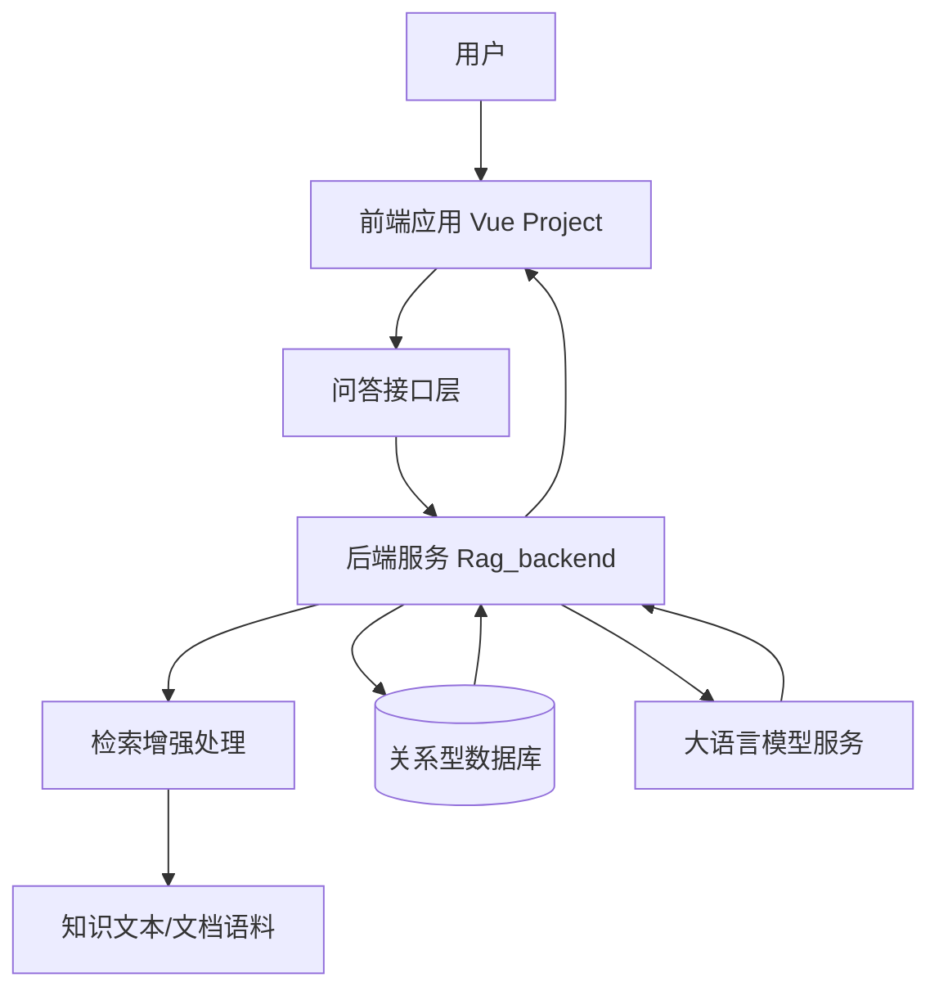
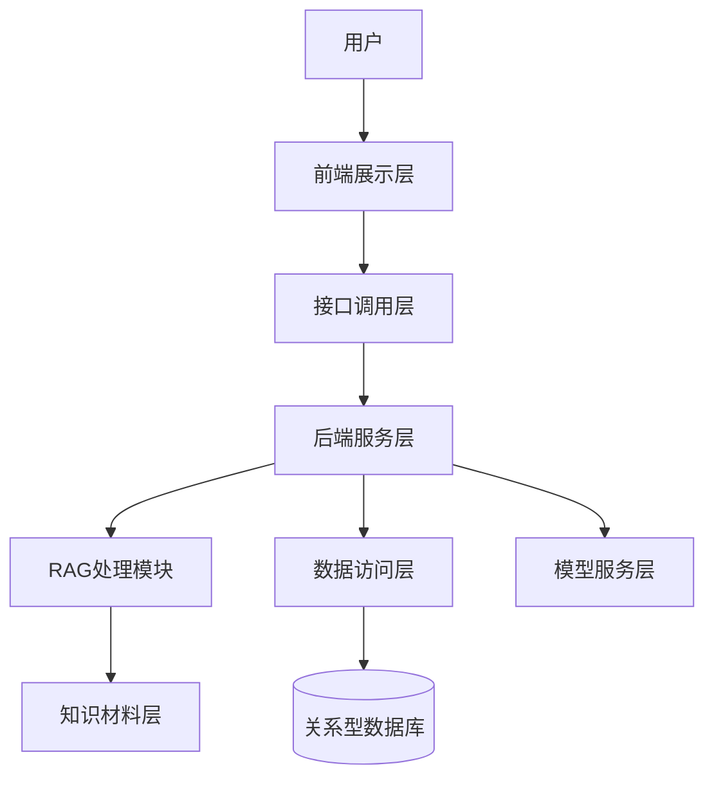
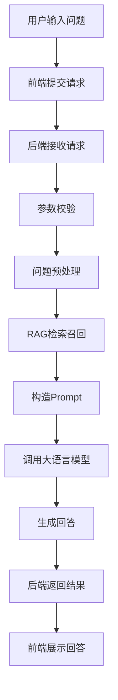
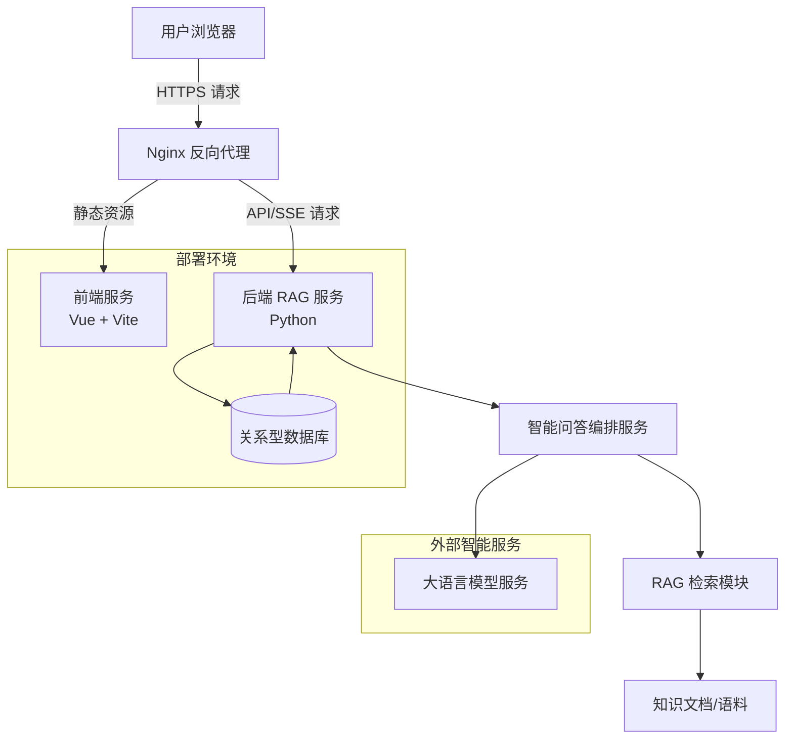

# 海外藏中国文物知识管理与服务平台——文博智问子系统 设计文档

## 1. 引言

### 1.1 文档目的

本文档用于描述“海外藏中国文物知识管理与服务平台”中“文博智问”知识问答子系统的设计方案，明确系统的建设目标、总体架构、模块划分、核心流程、接口组织、数据组织、非功能设计、部署方案与测试策略，为系统开发、联调、验收和后续扩展提供依据。

### 1.2 系统概述

“文博智问”子系统是面向海外藏中国文物知识服务场景构建的智能问答系统，主要服务于研究人员、文博从业者及普通用户，支持围绕文物实体、馆藏机构、历史背景及相关资料进行自然语言提问，并返回具有一定知识依据的智能回答。

结合当前项目代码仓库，系统采用前后端分离架构：
- 前端为独立的 Vue 工程 `vue-project`；
- 后端为独立的 Python RAG 服务工程 `Rag_backend`；
- 后端通过环境变量管理模型调用与系统运行配置；
- 系统整体围绕“问题输入—知识检索—模型生成—结果展示”的主流程组织实现。[^1][^2][^3]

与传统固定规则问答不同，本系统采用检索增强生成（RAG）的设计思路：在生成回答之前先从知识材料中检索相关内容，再将检索结果作为上下文提供给大语言模型，以提高回答的相关性、可用性和领域适配能力。

### 1.3 建设目标

本子系统的建设目标如下：

1. 支持用户使用自然语言提出文博领域相关问题；
2. 支持系统从知识材料中召回相关内容并生成回答；
3. 提高海外藏中国文物知识服务的可访问性与交互效率；
4. 为后续接入更丰富的数据源、检索能力和多轮会话能力预留扩展空间；
5. 为平台整体的知识组织、知识服务和智能辅助分析提供基础问答能力支撑。

### 1.4 目标读者

本文档适用于以下人员阅读和使用：

- 前端开发人员
- 后端开发人员
- 算法与模型开发人员
- 测试人员
- 项目管理人员
- 文博领域业务人员
- 系统维护与部署人员

### 1.5 术语与缩略语

| 术语 | 全称 | 描述 |
|---|---|---|
| RAG | Retrieval-Augmented Generation | 检索增强生成，通过先检索相关知识再组织模型回答 |
| LLM | Large Language Model | 大语言模型 |
| Prompt | Prompt | 发送给模型的提示词、约束和上下文文本 |
| Embedding | Embedding | 文本向量表示，用于语义相似度计算 |
| Frontend | Frontend | 前端用户界面工程 |
| Backend | Backend | 后端服务工程 |
| API | Application Programming Interface | 应用程序接口 |
| Context | Context | 提供给模型的上下文信息 |

### 1.6 参考文献

1. Vue.js 官方文档. Vue 3 Documentation. https://vuejs.org/
2. Spring Boot 官方文档. Spring Boot Reference Documentation. https://spring.io/projects/spring-boot
3. Spring Security 官方文档. Spring Security Reference Documentation. https://spring.io/projects/spring-security
4. MySQL 官方文档. MySQL 8.0 Reference Manual. https://dev.mysql.com/doc/refman/8.0/en/
5. Neo4j 官方文档. Neo4j Graph Database Documentation. https://neo4j.com/docs/
6. Milvus 官方文档. Milvus Vector Database Documentation. https://milvus.io/docs
7. Docker 官方文档. Docker Documentation. https://docs.docker.com/
8. Nginx 官方文档. NGINX Documentation. https://nginx.org/en/docs/
---

## 2. 系统架构设计

### 2.1 架构风格

系统采用前后端分离架构，并以检索增强生成为核心能力构建整体问答流程。前端负责用户交互与结果展示，后端负责问答编排、知识检索、模型调用及结果返回。

从职责划分看，系统可分为以下层次：

- **展示层**：负责页面展示、问题输入、回答渲染、状态反馈；
- **接口层**：负责接收前端请求、组织后端处理流程、返回响应结果；
- **业务处理层**：负责问题预处理、知识检索、上下文构造、模型生成；
- **知识支撑层**：负责知识文本、文档资料或后续扩展的数据源管理；
- **模型服务层**：负责接收 Prompt 并返回生成内容。

该架构具有以下优点：
1. 前后端职责清晰，便于并行开发；
2. 检索逻辑与界面逻辑解耦，便于后续优化；
3. 便于后续引入向量数据库、知识图谱、多模型切换等增强能力；
4. 有利于逐步从原型系统演进为工程化系统。

### 2.2 总体架构说明



### 2.3 总体处理流程

系统从用户输入到回答输出的基本处理流程如下：

1. 用户在前端页面输入自然语言问题；
2. 前端将问题通过 HTTP 请求发送给后端问答服务；
3. 后端接收请求并进行参数校验与预处理；
4. 后端根据问题内容触发 RAG 检索流程；
5. 系统从知识材料中召回相关片段；
6. 后端将用户问题与召回内容共同组织为 Prompt；
7. 后端调用外部大语言模型服务生成答案；
8. 后端将结果返回前端；
9. 前端对回答内容进行展示，并反馈加载、异常等状态。

### 2.4 总体分层架构图




### 2.5 技术栈

#### 2.5.1 前端技术栈

根据仓库 `vue-project` 的工程结构，前端采用 Vue 工程化开发方式，主要包括：

- Vue
- Vite
- npm 依赖管理
- 组件化页面开发方式[^3][^6]

#### 2.5.2 后端技术栈

根据仓库 `Rag_backend` 的工程结构，后端采用 Python 工程化开发方式，主要包括：

- Python
- `requirements.txt` 依赖管理
- `main.py` 作为服务入口
- `app/` 目录组织核心业务逻辑
- `.env.example` 用于环境变量配置[^2][^4][^5][^7]

#### 2.5.3 技术选型说明

当前项目文档采用“**已实现部分**”与“**可扩展部分**”相区分的写法：

- **已实现部分**：Vue 前端、Python 后端、RAG 后端目录组织、环境变量配置；
- **可扩展部分**：用户认证、历史会话持久化、向量数据库、知识图谱、缓存、容器化部署、日志监控等。

因此，本文档中的设计将以当前仓库实现为基础，同时对后续可扩展方向做合理规划，但不将尚未在代码中体现的能力描述为既有实现。

### 2.6 模块划分

#### 2.6.1 前端模块

前端主要划分为以下模块：

1. **页面入口模块**  
   负责应用初始化、根组件挂载和页面入口组织。

2. **路由与页面组织模块**  
   负责页面切换、视图组织和基础导航结构管理。

3. **问答交互模块**  
   负责问题输入、发送请求、接收回答和界面展示。

4. **请求通信模块**  
   负责封装前后端接口请求逻辑，并统一处理成功、失败和异常状态。

5. **公共组件模块**  
   负责按钮、输入框、提示信息、布局容器等通用组件复用。

#### 2.6.2 后端模块

后端主要划分为以下模块：

1. **服务入口模块**  
   负责启动后端服务并组织应用初始化。

2. **接口处理模块**  
   负责接收前端请求、校验输入参数、调用业务逻辑并返回结果。

3. **问答编排模块**  
   负责串联问题预处理、知识检索、上下文构造、模型调用与结果整合。

4. **RAG 检索模块**  
   负责从知识材料中召回与用户问题相关的文本内容。

5. **配置管理模块**  
   负责模型服务地址、密钥、运行参数及相关环境变量的统一加载和管理。

6. **知识材料处理模块**  
   负责知识文档、文本资料或其他知识源的组织、读取与接入。

---


## 3. 详细设计

### 3.1 前端详细设计

#### 3.1.1 页面入口模块

页面入口模块负责初始化前端应用，完成全局样式加载、应用实例创建及主页面挂载。

其主要职责包括：
- 创建 Vue 应用实例；
- 挂载根组件；
- 初始化全局依赖；
- 准备后续页面与组件的运行环境。

#### 3.1.2 问答交互模块

问答交互模块是前端核心模块，直接面向用户提供问答功能。

主要职责包括：
- 接收用户输入的问题；
- 发起问答请求；
- 展示系统返回的回答；
- 在请求处理中提示加载状态；
- 在发生异常时进行友好提示。

该模块在交互层面应重点关注以下要求：
1. 输入框操作简单明确；
2. 对提交中的状态提供可视反馈；
3. 支持较长文本回答的良好展示；
4. 保证多次连续提问时界面状态稳定。

#### 3.1.3 请求通信模块

请求通信模块负责前端与后端之间的接口通信封装。

其职责包括：
- 统一管理请求地址；
- 组织请求参数；
- 接收并解析后端返回数据；
- 捕获网络异常与接口异常；
- 为问答交互模块提供可复用的调用能力。

#### 3.1.4 公共组件模块

公共组件模块用于提升前端工程的可维护性和复用性。

典型组件包括：
- 输入框组件；
- 按钮组件；
- 结果展示容器；
- 加载提示组件；
- 错误提示组件。

---

### 3.2 后端详细设计

#### 3.2.1 服务入口模块

后端通过 `main.py` 作为服务入口文件，负责完成应用启动与服务初始化。[^5]

其主要职责包括：
- 启动 Web 服务；
- 加载基础配置；
- 初始化接口路由；
- 连接业务处理模块。

#### 3.2.2 接口处理模块

接口处理模块负责接收前端发送的问答请求，并将请求分发给具体业务流程。

主要职责包括：
- 接收用户问题；
- 校验请求格式与参数合法性；
- 调用问答编排模块；
- 将处理结果组织为统一响应并返回前端。

为保证系统稳定性，该模块应尽量避免承担复杂业务逻辑，主要承担“请求接入”和“结果返回”的职责。

#### 3.2.3 问答编排模块

问答编排模块是系统核心模块，负责串联完整的问答处理链路。

其主要职责包括：
1. 对用户问题进行预处理；
2. 调用检索模块获取相关知识片段；
3. 将问题与知识片段拼接为 Prompt；
4. 调用模型服务生成答案；
5. 对生成结果进行整理后返回接口层。

该模块的设计应遵循以下原则：
- 职责集中，不与接口层耦合；
- 检索与生成流程可独立替换；
- 支持后续增加上下文拼接、重排序、回答后处理等能力。

#### 3.2.4 RAG 检索模块

RAG 检索模块用于从知识材料中找出与用户问题相关的文本内容，为模型回答提供依据。

主要职责包括：
- 接收用户问题；
- 执行知识召回；
- 返回候选知识片段；
- 为 Prompt 构造提供上下文材料。

当前项目从目录命名与工程结构上已体现该模块作为系统核心能力存在。[^2]

从设计角度看，RAG 检索模块后续可演进出以下能力：
- 文本分块；
- 关键词检索；
- 语义向量检索；
- 混合检索；
- 检索结果重排序；
- 多来源知识融合。

#### 3.2.5 配置管理模块

后端通过环境变量对模型服务相关配置与运行参数进行统一管理，`.env.example` 提供了配置模板。[^4]

该模块主要职责包括：
- 加载环境变量；
- 统一管理模型地址、访问密钥与运行参数；
- 避免将敏感信息硬编码到源码中；
- 为不同运行环境提供灵活配置能力。

#### 3.2.6 知识材料处理模块

知识材料处理模块用于管理问答系统依赖的知识来源。

其主要职责包括：
- 组织知识文本或文档；
- 为检索模块提供可访问的数据来源；
- 支持后续增加新的领域材料和知识源格式。

在当前阶段，该模块以知识材料组织与接入为主，后续可继续扩展为完整的知识库管理能力。

---

### 3.3 核心流程设计

#### 3.3.1 问答处理流程



#### 3.3.2 处理流程说明

1. 用户通过前端输入自然语言问题；
2. 前端调用后端问答接口；
3. 后端完成请求参数校验；
4. 后端对问题进行必要的预处理；
5. RAG 模块从知识材料中召回相关上下文；
6. 系统将问题和检索结果组合为 Prompt；
7. 模型服务根据 Prompt 生成回答；
8. 后端将回答组织为响应结果；
9. 前端接收结果并进行展示。

---

### 3.4 接口设计

#### 3.4.1 接口概览

当前系统问答服务采用 **Server-Sent Events（SSE）流式接口**，前端通过 `EventSource` 或 `fetch + ReadableStream` 方式接收服务端推送的结构化事件流。该设计可实现回答内容的实时分片渲染，提升用户交互体验。

#### 3.4.2 核心问答接口

##### 接口路径

```
POST /api/chat
```

##### 请求头

| 头字段 | 值 | 说明 |
|--------|----|------|
| `Content-Type` | `application/json` | 请求体为 JSON 格式 |
| `Accept` | `text/event-stream` | 明确要求返回 SSE 流式数据 |

##### 请求体示例

```json
{
  "question": "清明上河图收藏在哪里？"
}
```

##### 请求参数说明

| 参数名 | 类型 | 是否必填 | 说明 |
|--------|------|----------|------|
| `question` | string | 是 | 用户输入的自然语言问题，长度建议 ≤ 1000 字符 |


#### 3.4.3 响应格式（SSE 事件流）

服务端以 `Content-Type: text/event-stream` 返回，按以下事件顺序推送（顺序为推荐顺序，客户端应以 `event` 类型而非顺序判断处理逻辑）：

| 事件名 | 说明 | 出现次数 | 客户端处理建议 |
|--------|------|----------|----------------|
| `llm` | 大语言模型生成内容分片 | ≥0 次 | 按顺序拼接并实时渲染 |
| `source` | 答案参考来源信息 | ≥0 次 | 收集后展示为“参考资料”列表 |
| `img` | 相关图片链接 | ≥0 次 | 收集后展示为图片列表或内联插入 |
| `done` | 回答结束标志 | 1 次 | 关闭连接，终止本次流式接收 |
| `error` | 异常信息 | 0 或 1 次 | 终止接收，提示用户错误信息 |

##### 事件格式规范

所有事件遵循标准 SSE 格式：
```
event: <type>
data: <json_or_text>
```
其中 `data` 为原始字符串，**不自动添加换行或转义**；JSON 类型字段需由服务端确保为合法 JSON 字符串。

#### 3.4.4 事件详情

##### llm 事件

- 用于流式返回模型生成的文本片段；
- 多个 `llm` 事件内容需按顺序拼接为完整回答；
- 示例：
  ```
  event: llm
  data: 《清明
  ```
  ```
  event: llm
  data: 上河图》现藏于北京故宫博物院。
  ```

##### source 事件

- `data` 为 JSON 对象，字段如下：
  | 字段名 | 类型 | 说明 |
  |--------|------|------|
  | `name` | string | 来源名称（如“故宫博物院官网”） |
  | `url` | string | 来源链接（可选，若无则省略） |

- 示例：
  ```
  event: source
  data: {"name":"故宫博物院官网","url":"https://www.dpm.org.cn/"}
  ```

##### img 事件

- `data` 为 JSON 对象，字段如下：
  | 字段名 | 类型 | 说明 |
  |--------|------|------|
  | `url` | string | 图片资源 URL（必须） |

- 示例：
  ```
  event: img
  data: {"url":"https://example.com/images/qingming.jpg"}
  ```

##### done 事件

- 表示本次问答流程结束；
- `data` 可为任意文本（推荐 `"end"`）；
- 收到后应立即关闭 `EventSource` 或中断流式读取；
- 示例：
  ```
  event: done
  data: end
  ```

##### error 事件

- 服务端发生异常时推送；
- `data` 为错误提示字符串；
- 客户端应终止接收并提示用户；
- 示例：
  ```
  event: error
  data: 系统异常，请稍后重试
  ```

#### 3.4.5 完整响应示例

```text
event: llm
data: 《清明

event: llm
data: 上河图》

event: llm
data: 现藏于北京故宫博物院。

event: source
data: {"name":"故宫博物院官网","url":"https://www.dpm.org.cn/"}

event: source
data: {"name":"中国国家博物馆","url":"https://www.chnmuseum.cn/"}

event: img
data: {"url":"https://example.com/images/qingming1.jpg"}

event: img
data: {"url":"https://example.com/images/qingming2.jpg"}

event: done
data: end
```

### 3.5 数据库设计

#### 3.5.1 关系型数据库设计 MySQL
#### 3.5.1.1 用户表 `sys_user`
| 字段名 | 类型 | 约束 | 说明 |
|---|---|---|---|
| id | bigint | 主键，自增 | 用户 ID |
| username | varchar(50) | 非空，唯一 | 用户名 |
| email | varchar(100) | 唯一 | 邮箱 |
| password | varchar(255) | 非空 | 加密后的密码 |
| nickname | varchar(50) | 可空 | 用户昵称 |
| avatar | varchar(255) | 可空 | 用户头像地址 |
| role | varchar(20) | 默认 USER | 用户角色 |
| status | tinyint | 默认 1 | 状态：0-禁用，1-正常 |
| create_time | datetime | 非空 | 创建时间 |
| update_time | datetime | 非空 | 更新时间 |
| deleted | tinyint | 默认 0 | 逻辑删除标记 |

#### 3.5.1.2  会话表 qa_conversation
| 字段名 | 类型 | 约束 | 说明 |
|---|---|---|---|
| id | bigint | 主键，自增 | 会话 ID |
| user_id | bigint | 非空，索引 | 用户 ID |
| title | varchar(100) | 非空 | 会话标题 |
| summary | varchar(500) | 可空 | 会话摘要 |
| message_count | int | 默认 0 | 消息数量 |
| last_message_time | datetime | 可空 | 最后一条消息时间 |
| create_time | datetime | 非空 | 创建时间 |
| update_time | datetime | 非空 | 更新时间 |
| deleted | tinyint | 默认 0 | 逻辑删除标记 |
#### 3.5.1.3  问答消息表 qa_message
| 字段名 | 类型 | 约束 | 说明 |
|---|---|---|---|
| id | bigint | 主键，自增 | 消息 ID |
| conversation_id | bigint | 非空，索引 | 会话 ID |
| user_id | bigint | 非空，索引 | 用户 ID |
| role | varchar(20) | 非空 | 消息角色：user / assistant / system |
| question | text | 可空 | 用户问题 |
| answer | longtext | 可空 | AI 回答 |
| content | longtext | 可空 | 消息内容 |
| reference_data | json | 可空 | 引用来源 |
| rag_enabled | tinyint | 默认 1 | 是否启用 RAG |
| model_name | varchar(100) | 可空 | 调用模型名称 |
| prompt_tokens | int | 默认 0 | Prompt token 数 |
| completion_tokens | int | 默认 0 | 回答 token 数 |
| total_tokens | int | 默认 0 | 总 token 数 |
| response_time | int | 可空 | 响应耗时，单位毫秒 |
| create_time | datetime | 非空 | 创建时间 |
#### 3.5.1.4  用户反馈表 qa_feedback
| 字段名 | 类型 | 约束 | 说明 |
|---|---|---|---|
| id | bigint | 主键，自增 | 反馈 ID |
| user_id | bigint | 非空，索引 | 用户 ID |
| message_id | bigint | 非空，索引 | 消息 ID |
| feedback_type | varchar(20) | 非空 | 反馈类型：like / dislike / correction |
| score | tinyint | 可空 | 评分，1-5 |
| content | varchar(1000) | 可空 | 反馈内容 |
| status | varchar(20) | 默认 pending | 处理状态 |
| create_time | datetime | 非空 | 创建时间 |
| update_time | datetime | 非空 | 更新时间 |
#### 3.5.1.5  知识来源表 qa_reference
| 字段名 | 类型 | 约束 | 说明 |
|---|---|---|---|
| id | bigint | 主键，自增 | 来源 ID |
| message_id | bigint | 非空，索引 | 消息 ID |
| title | varchar(255) | 可空 | 来源标题 |
| source_type | varchar(50) | 可空 | 来源类型：文物、文献、网页、知识图谱等 |
| source_id | varchar(100) | 可空 | 来源对象 ID |
| content_snippet | text | 可空 | 引用片段 |
| score | decimal(5,4) | 可空 | 相关性得分 |
| url | varchar(500) | 可空 | 来源链接 |
| create_time | datetime | 非空 | 创建时间 |

### 3.6 用户界面设计

#### 3.6.1 页面组成

当前系统前端可按以下页面结构设计：

1. **主问答页面**
   - 问题输入区域
   - 回答展示区域
   - 请求状态提示区域

2. **扩展页面预留**
   - 历史会话页面
   - 知识来源展示页面
   - 系统说明页面

#### 3.6.2 交互流程

1. 用户进入问答页面；
2. 在输入框中输入问题；
3. 点击发送后前端发起请求；
4. 页面显示加载状态；
5. 后端返回结果后展示回答；
6. 如请求失败，则展示错误信息并允许重新提交。

#### 3.6.3 界面设计原则

- 交互简洁直观；
- 重点突出“提问—回答”主流程；
- 对长文本回答具有良好的显示效果；
- 对加载、失败、空结果等状态给出清晰反馈；
- 保持较好的可读性与响应速度。

---

## 4. 非功能性设计

### 4.1 性能设计

#### 4.1.1 前端性能要求

- 减少不必要的重复渲染；
- 对长文本回答采用合理展示方式；
- 控制请求频率，避免重复提交；
- 优化页面资源加载效率。

#### 4.1.2 后端性能要求

- 控制检索和模型调用链路的总体耗时；
- 对超长输入进行长度限制和预处理；
- 对召回片段数量进行合理控制，避免上下文过长；
- 对外部依赖调用设置超时机制。

#### 4.1.3 可选性能优化方向

后续可进一步考虑：
- 相似问题缓存；
- 知识片段缓存；
- 并发请求控制；
- 模型调用限流；
- 检索与生成链路监控。

### 4.2 安全设计

#### 4.2.1 配置安全

- 通过环境变量管理密钥、服务地址等敏感配置；
- 避免将敏感信息直接写入源码；
- 区分开发环境与生产环境配置。[^4]

#### 4.2.2 输入安全

- 对用户输入内容进行长度校验；
- 对异常字符和非法格式进行处理；
- 防止恶意构造输入对后端服务造成压力。

#### 4.2.3 接口安全

当前仓库未明确体现完整用户认证体系，因此本阶段应至少满足：
- 基础参数校验；
- 异常输入拦截；
- 统一错误处理。

后续如引入用户体系，可继续增加：
- 登录鉴权；
- 访问令牌；
- 接口权限控制；
- 请求频率限制。

### 4.3 容错设计

- 当模型服务不可用时，应返回明确错误信息；
- 当知识检索结果不足时，系统应允许给出有限回答并提示知识可能不完整；
- 当配置缺失时，系统应在启动阶段给出可解释的错误；
- 当单次请求处理失败时，应避免影响整体服务可用性。

### 4.4 可扩展性设计

#### 4.4.1 功能扩展

系统后续可扩展以下功能：
- 多轮会话；
- 会话历史保存；
- 知识来源展示；
- 用户反馈纠错；
- 回答评分；
- 多模型切换。

#### 4.4.2 数据扩展

系统后续可扩展以下知识源：
- 文物基础信息数据；
- 馆藏机构资料；
- 文献条目；
- 图谱实体关系；
- 向量化知识片段库。

#### 4.4.3 工程扩展

系统后续可逐步引入：
- 向量数据库；
- 关系型数据库；
- 缓存中间件；
- 容器化部署；
- 日志监控；
- 自动化测试与持续集成。

---

## 5. 部署与运维设计

### 5.1 部署架构

当前系统适合采用前后端分离的基础部署方案。



### 5.2 运行环境

#### 5.2.1 开发环境

**前端环境**
- Node.js
- npm
- Vue
- Vite

**后端环境**
- Python
- `requirements.txt` 中定义的依赖[^7]

**配置方式**
- 使用 `.env` 或同类环境变量配置方式[^4]

#### 5.2.2 部署环境

基础部署建议如下：
- 前端构建为静态资源并部署；
- 后端独立运行 Python 服务；
- 通过环境变量注入模型服务相关配置；
- 保障后端服务对外接口稳定可访问。

### 5.3 运维建议

#### 5.3.1 日志管理

建议记录以下信息：
- 服务启动日志；
- 请求接入日志；
- 检索流程日志；
- 模型调用日志；
- 异常日志。

#### 5.3.2 配置管理

- 将不同环境配置分离管理；
- 对敏感配置进行权限控制；
- 定期检查模型服务配置有效性。

#### 5.3.3 监控建议

后续建议逐步增加：
- 服务可用性监控；
- 接口耗时监控；
- 错误率监控；
- 模型调用失败率监控；
- 检索命中率监控。

---

## 6. 验证与测试策略

### 6.1 测试目标

测试工作的主要目标包括：
1. 验证前后端主问答链路可正常运行；
2. 验证输入、检索、生成、展示等关键环节逻辑正确；
3. 验证异常场景下系统具有基本稳定性；
4. 为后续优化准确率和交互体验提供基础测试依据。

### 6.2 前端测试

#### 6.2.1 测试重点

- 输入框交互是否正常；
- 点击发送后是否发起请求；
- 加载状态是否正确显示；
- 请求失败时是否提示用户；
- 长文本回答是否可正常展示。

#### 6.2.2 测试方式

- 组件测试；
- 页面联调测试；
- 手工交互测试。

### 6.3 后端测试

#### 6.3.1 测试重点

- 请求参数是否能正确接收；
- 空问题、超长问题是否能被正确处理；
- RAG 检索模块是否能输出可用结果；
- 模型服务异常时是否能返回明确错误；
- 配置缺失时系统是否能及时报错。

#### 6.3.2 测试方式

- 接口测试；
- 关键函数测试；
- 异常场景测试；
- 联调测试。

### 6.4 集成测试

集成测试围绕完整问答链路开展，主要验证：

1. 用户输入问题后前端是否正常发送请求；
2. 后端是否完成检索与模型调用；
3. 返回结果是否能被前端正确接收与展示；
4. 失败场景是否可被用户感知和处理。

### 6.5 测试场景建议

| 编号 | 测试场景 | 预期结果 |
|---|---|---|
| T1 | 输入正常问题 | 返回可读回答 |
| T2 | 输入空问题 | 给出参数错误提示 |
| T3 | 输入超长问题 | 给出长度限制提示或截断处理 |
| T4 | 模型服务不可用 | 返回明确错误信息 |
| T5 | 知识召回不足 | 返回有限回答并保持系统稳定 |
| T6 | 连续多次提问 | 系统无明显异常或状态错乱 |

---

## 7. 风险与应对措施

### 7.1 技术风险

| 风险 | 影响程度 | 应对措施 |
|---|---|---|
| 外部模型服务不稳定 | 高 | 设置超时、重试及错误提示机制 |
| 检索知识材料不足 | 高 | 持续补充领域知识数据，优化检索策略 |
| 回答准确率波动 | 中 | 优化 Prompt、扩展知识源、人工评估结果质量 |
| 前后端联调不一致 | 中 | 固化接口参数与返回格式，维护联调文档 |
| 环境配置不规范 | 中 | 统一通过环境变量管理配置 |
| 系统扩展时结构耦合加重 | 中 | 保持模块边界清晰，分层设计 |

### 7.2 资源与工程风险

1. **模型调用成本风险**  
   随着请求量增加，模型调用成本可能上升。  
   **应对措施**：控制上下文长度、减少无效请求、引入缓存和模型分级调用策略。

2. **响应时延风险**  
   检索与生成串行执行可能导致响应时间变长。  
   **应对措施**：优化检索规模、减少冗余上下文、设置请求超时。

3. **知识材料质量风险**  
   如果知识材料质量不高，将直接影响回答可信度。  
   **应对措施**：加强知识数据清洗、分块和来源管理。

---

## 8. 设计约束

### 8.1 实现一致性约束

- 文档描述必须与当前仓库结构保持一致；
- 未在代码中体现的能力，不应直接描述为已实现；
- 对尚未定稿的接口和数据结构，应以草案或扩展设计形式表达。

### 8.2 工程规范约束

#### 前端规范
- 采用 Vue 工程化组织方式；
- 组件职责明确，避免页面逻辑过度耦合；
- 请求逻辑统一封装，避免散落在多个页面中。

#### 后端规范
- 服务入口、接口层、业务层职责分离；
- 配置项统一通过环境变量管理；
- 检索逻辑与接口逻辑解耦；
- 对异常处理、参数校验保持统一风格。

### 8.3 数据与安全约束

- 知识材料应与代码逻辑解耦管理；
- 敏感配置不得硬编码；
- 对外部服务调用必须考虑失败场景；
- 所有用户输入都应纳入有效性校验范围。

---
