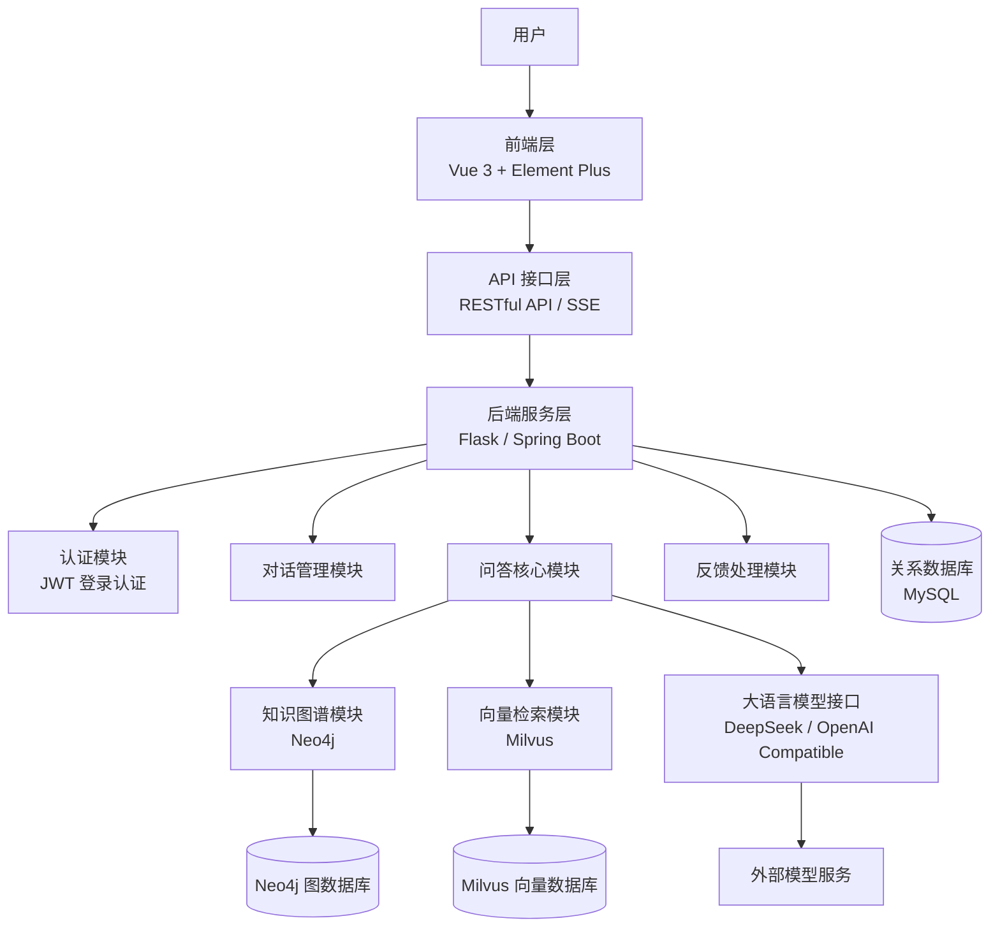
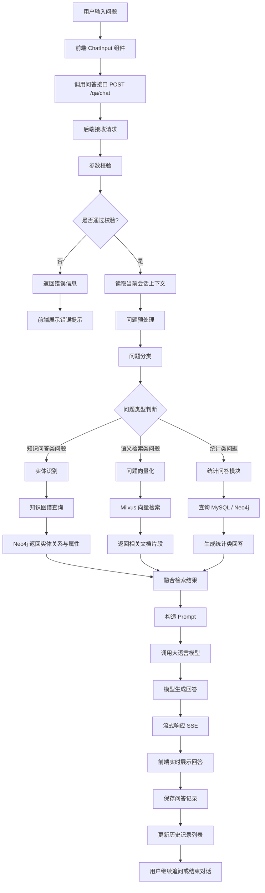
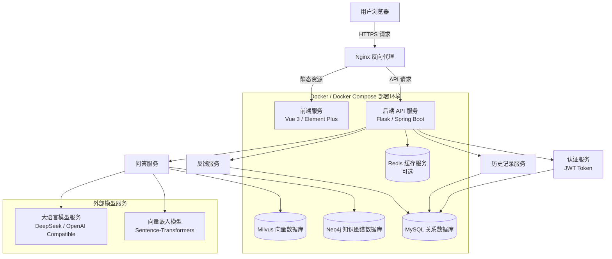

# 海外藏中国文物知识管理与服务平台知识问答子系统 设计文档

## 1. 引言

### 1.1 文档目的

本文档用于描述知识问答子系统的总体架构、模块划分、接口设计、数据库设计、安全设计、部署方案和测试策略，为系统开发、运维和后续扩展提供技术依据。

### 1.2 系统概述

______________知识问答子系统是基于知识图谱、向量检索和大语言模型的智能问答系统。系统能够接收用户自然语言问题，结合结构化知识、语义向量和文档片段生成准确回答，支持多轮对话、历史记录管理、答案来源展示和反馈纠错。

### 1.3 目标读者

- 前端开发人员
- 后端开发人员
- 算法工程师
- 测试工程师
- 运维人员
- 项目管理人员
- 文物知识专家

### 1.4 术语与缩略语

| 术语 | 全称 | 描述 |
|---|---|---|
| RAG | Retrieval-Augmented Generation | 检索增强生成，通过检索相关知识增强大语言模型回答质量的技术 |
| LLM | Large Language Model | 大语言模型，如ChatGPT等 |
| KG | Knowledge Graph | 知识图谱，描述实体及其关系的语义网络 |
| JWT | JSON Web Token | 基于JSON的开放标准，用于在网络应用间传递声明的令牌 |

### 1.5 参考文献

1. 
2. 
3. 
4. 
5. 
6. 

---

## 2. 系统架构设计

### 2.1 架构风格

_________采用前后端分离的分层架构，主要由以下几个部分组成：

- 前端层：Vue
- 后端层：Spring Boot
- API层：
- 业务层：
- 数据层：
- 外部服务层：

### 2.2 总体分层架构图（大体框架,待修改）



### 2.3 技术栈

#### 前端技术栈

- 核心框架：vue
- 状态管理：
- 路由管理：
- UI组件库：
- HTTP客户端：
- Markdown渲染：
- 构建工具：

#### 后端技术栈

- 核心框架：Spring Boot
- Web框架：
- ORM框架：
- 认证方案：
- 大语言模型：
- 向量嵌入：
- 向量数据库：
- 图数据库：
- 关系数据库：MySql

#### 部署技术

- 容器化：Docker + Docker Compose
- 反向代理：
- 环境管理：

| 类别 | 技术选型 |
|---|---|
| 前端框架 | Vue.js 3.x |
| 状态管理 | Pinia |
| 路由管理 | Vue Router |
| UI 组件库 | Element Plus |
| HTTP 客户端 | Axios |
| 后端框架 | Flask 2.x |
| ORM | SQLAlchemy |
| 关系数据库 | MySQL |
| 图数据库 | Neo4j |
| 向量数据库 | Milvus |
| 大语言模型 | DeepSeek / OpenAI 兼容模型 |
| 向量嵌入 | Sentence-Transformers 或等价模型 |
| 部署 | Docker、Nginx、Gunicorn |

### 2.4 模块划分

#### 前端模块

- 认证模块：登录、注册、用户状态管理。
- 对话模块：消息输入、消息展示、流式输出。
- 历史记录模块：新建、查询、重命名、删除对话。
- 反馈模块：答案评价、问题反馈。
- 公共组件模块：布局、导航、弹窗、加载状态等。

#### 后端模块

- 认证模块：用户注册、登录、JWT 生成和验证。
- 对话管理模块：对话创建、历史查询、重命名和删除。
- 问答核心模块：问题分类、实体识别、检索调度和答案生成。
- 知识图谱模块：实体查询、关系查询、属性查询。
- 向量检索模块：文本向量化、相似度检索、片段召回。
- 统计问答模块：数量统计、类别统计、机构统计等。
- 模型接口模块：提示词构造、模型调用、流式响应。
- 反馈处理模块：用户反馈记录、纠错建议管理。

---

## 3. 详细设计

### 3.1 模块设计

#### 3.1.1 后端核心模块

##### 认证模块

- 职责：处理用户注册、登录、信息获取等功能
- 主要组件：
  - `auth/routes.py`：定义认证相关API路由
  - `utils.py`：密码加密、token生成等工具函数

##### 问答模块

- 职责：处理用户问题，生成回答
- 主要组件：
  - `qa/routes.py`：问答API路由
  - `qa/RAG/`：RAG相关实现
  - `RAG.py`：向量检索实现
  - `statistical.py`：统计类问题处理

##### 流程图：问答处理流程(大体框架,待修改)

##



#### 3.1.2 前端核心模块

##### 对话组件

- 职责：显示对话界面，处理消息发送和接收
- 主要组件：
  - `ChatView.vue`：对话页面
  - `ChatInput.vue`：消息输入组件
  - `ChatMessage.vue`：消息展示组件
  - `ChatHistory.vue`：历史记录组件

##### 状态管理

- 职责：管理全局状态
- 主要组件：
  - `stores/user.js`：用户状态管理
  - `stores/chat.js`：对话状态管理

---

### 3.2 接口设计

## 3.2.1 个人信息相关接口

### 3.2.1.1 用户注册

#### 3.2.1.1.1 基本信息

- 请求路径：`/auth/register`
- 请求方式：`POST`
- 接口描述：该接口用于注册新用户

#### 3.2.1.1.2 请求参数

请求参数格式：`x-www-form-urlencoded`

请求参数说明：

| 参数名称 | 类型 | 是否必须 | 说明 | 备注 |
|---|---|---|---|---|
| username | string | 是 | 用户名 |  |
| email | string | 是 | 邮箱 |  |
| password | string | 是 | 密码 | 5~16位非空字符 |
| repassword | string | 是 | 确认密码 | 5~16位非空字符 |

#### 3.2.1.1.3 响应数据

响应数据类型：`application/json`

响应参数说明：

| 参数名称 | 类型 | 是否必须 | 默认值 | 备注 | 其他信息 |
|---|---|---|---|---|---|
| code | number | 必须 |  | 响应码, 0-成功,1-失败 |  |
| message | string | 非必须 |  | 提示信息 |  |
| data | object | 非必须 |  | 返回的数据 |  |

响应数据样例：

```json
{
  "code": 0,
  "message": "操作成功",
  "data": null
}
```

---

### 3.2.1.2 登录

#### 3.2.1.2.1 基本信息

- 请求路径：`/auth/login`
- 请求方式：`POST`
- 接口描述：该接口用于登录

#### 3.2.1.2.2 请求参数

请求参数格式：`x-www-form-urlencoded`

请求参数说明：

| 参数名称 | 类型 | 说明 | 是否必须 | 备注 |
|---|---|---|---|---|
| username | string | 用户名 | 是 |  |
| password | string | 密码 | 是 | 5~16位非空字符 |

#### 3.2.1.2.3 响应数据

响应数据类型：`application/json`

响应参数说明：

| 名称 | 类型 | 是否必须 | 默认值 | 备注 | 其他信息 |
|---|---|---|---|---|---|
| code | number | 必须 |  | 响应码, 0-成功,1-失败 |  |
| message | string | 非必须 |  | 提示信息 |  |
| data | string | 必须 |  | 返回的数据,jwt令牌 |  |
| \|-userId | number | 必须 |  | 用户ID |  |

响应数据样例：

```json
{
  "code": 0,
  "message": "操作成功",
  "data": "eyJhbGciOiJIUzI1NiIsInR5cCI6IkpXVCJ9.eyJjbGFpbXMiOnsiaWQiOjUsInVzZXJuYW1lIjoid2F uZ2JhIn0sImV4cCI6MTY5MzcxNTk3OH0.pE_RATcoF7Nm9KEp9eC3CzcBbKWAFOL0IsuMNjnZ95M"
}
```

#### 3.2.1.2.4 备注说明

用户登录成功后，系统会自动下发JWT令牌，然后在后续的每次请求中，浏览器都需要在请求头header中携带到服务端，请求头的名称为 `Authorization`，值为登录时下发的JWT令牌。

如果检测到用户未登录，则HTTP响应状态码为 `401`。

---

### 3.2.1.3 获取用户信息

#### 3.2.1.3.1 基本信息

- 请求路径：`/auth/getuserInfo`
- 请求方式：`GET`
- 接口描述：该接口用于获取历史记录详细信息

#### 3.2.1.3.2 请求参数

请求参数格式：`x-www-form-urlencoded`

请求参数说明：无

#### 3.2.1.3.3 响应数据

响应数据类型：`application/json`

响应参数说明：

| 名称 | 类型 | 是否必须 | 默认值 | 备注 | 其他信息 |
|---|---|---|---|---|---|
| code | number | 必须 |  | 响应码, 0-成功,1-失败 |  |
| message | string | 非必须 |  | 提示信息 |  |
| data | object | 必须 |  | 返回的数据 |  |
| \|-userId | number | 必须 |  | 用户Id |  |
| \|-username | string | 必须 |  | 用户名 |  |

响应数据样例：

```json
{
  "code": 0,
  "message": "操作成功",
  "data": {
    "userId": 1,
    "username": "zhangsan"
  }
}
```

---

## 3.2.2 问答相关接口

### 3.2.2.1 获取历史记录列表

#### 3.2.2.1.1 基本信息

- 请求路径：`/qa/getHistoryList`
- 请求方式：`GET`
- 接口描述：该接口用于获取当前用户所有问答历史记录

#### 3.2.2.1.2 请求参数

请求参数格式：`queryString`

请求参数说明：

| 参数名称 | 类型 | 说明 | 是否必须 | 备注 |
|---|---|---|---|---|
| userId | number | 用户ID | 是 |  |

请求数据样例：

```text
userId=1
```

#### 3.2.2.1.3 响应数据

响应数据类型：`application/json`

响应参数说明：

| 名称 | 类型 | 是否必须 | 默认值 | 备注 | 其他信息 |
|---|---|---|---|---|---|
| code | number | 必须 |  | 响应码, 0-成功,1-失败 |  |
| message | string | 非必须 |  | 提示信息 |  |
| data | array | 必须 |  | 返回的数据 |  |
| \|-historyId | number | 非必须 |  | 历史记录ID |  |
| \|-topic | string | 非必须 |  | 历史记录名称 |  |

响应数据样例：

```json
{
  "code": 0,
  "message": "操作成功",
  "data": [
    {
      "historyId": 1,
      "historyName": "会话1"
    },
    {
      "historyId": 2,
      "historyName": "会话2"
    },
    {
      "historyId": 3,
      "historyName": "会话3"
    }
  ]
}
```

---

### 3.2.2.2 获取历史记录详细信息

#### 3.2.2.2.1 基本信息

- 请求路径：`/qa/getHistoryInfo`
- 请求方式：`GET`
- 接口描述：该接口用于获取历史记录详细信息

#### 3.2.2.2.2 请求参数

请求参数格式：`queryString`

请求参数说明：

| 参数名称 | 类型 | 说明 | 是否必须 | 备注 |
|---|---|---|---|---|
| historyId | number | 历史记录ID | 是 | 8位非空字符 |

请求数据样例：

```text
historyId=1
```

#### 3.2.2.2.3 响应数据

响应数据类型：`application/json`

响应参数说明：

| 名称 | 类型 | 是否必须 | 默认值 | 备注 | 其他信息 |
|---|---|---|---|---|---|
| code | number | 必须 |  | 响应码, 0-成功,1-失败 |  |
| message | string | 非必须 |  | 提示信息 |  |
| data | object | 必须 |  | 返回的数据 |  |
| \|-question | string | 必须 |  | 问题 |  |
| \|-answer | string | 必须 |  | 回答 |  |
| \|-reference | string | 必须 |  | 参考 |  |

响应数据样例：

```json
{
  "code": 0,
  "message": "操作成功",
  "data": [
    {
      "question": "这是一条记录 ...",
      "answer": "这是一条回答 ...",
      "reference": "参考 ..."
    },
    {
      "question": "这是一条记录 ...",
      "answer": "这是一条回答 ...",
      "reference": "参考 ..."
    }
  ]
}
```

---

### 3.2.2.3 新建对话

#### 3.2.2.3.1 基本信息

- 请求路径：`/qa/create`
- 请求方式：`POST`
- 接口描述：该接口用于新建对话

#### 3.2.2.3.2 请求参数

请求参数格式：`queryString`

请求参数说明：

| 参数名称 | 类型 | 说明 | 是否必须 | 备注 |
|---|---|---|---|---|
| userId | number | 用户ID | 是 |  |
| historyName | String | 历史记录标题 | 是 |  |

请求数据样例：

```text
userId=1&historyName=新对话
```

#### 3.2.2.3.3 响应数据

响应数据类型：`application/json`

响应参数说明：

| 名称 | 类型 | 是否必须 | 默认值 | 备注 | 其他信息 |
|---|---|---|---|---|---|
| code | number | 必须 |  | 响应码, 0-成功,1-失败 |  |
| message | string | 非必须 |  | 提示信息 |  |
| data | object | 非必须 |  | 返回的数据 |  |
| \|-historyId | number | 必须 |  | 历史记录ID |  |

响应数据样例：

```json
{
  "code": 0,
  "message": "操作成功",
  "data": {
    "historyId": 1
  }
}
```

---

### 3.2.2.4 重命名历史记录

#### 3.2.2.4.1 基本信息

- 请求路径：`/qa/rename`
- 请求方式：`PATCH`
- 接口描述：该接口用于重命名历史记录

#### 3.2.2.4.2 请求参数

请求参数格式：`queryString`

请求参数说明：

| 参数名称 | 类型 | 说明 | 是否必须 | 备注 |
|---|---|---|---|---|
| historyId | number | 历史记录ID | 是 |  |
| newName | string | 新名称 | 是 |  |

请求数据样例：

```text
historyId=6&newName=新名称
```

#### 3.2.2.4.3 响应数据

响应数据类型：`application/json`

响应参数说明：

| 名称 | 类型 | 是否必须 | 默认值 | 备注 | 其他信息 |
|---|---|---|---|---|---|
| code | number | 必须 |  | 响应码, 0-成功,1-失败 |  |
| message | string | 非必须 |  | 提示信息 |  |
| data | object | 非必须 |  | 返回的数据 |  |

响应数据样例：

```json
{
  "code": 0,
  "message": "操作成功",
  "data": null
}
```

---

### 3.2.2.5 删除历史记录

#### 3.2.2.5.1 基本信息

- 请求路径：`/qa/delete`
- 请求方式：`DELETE`
- 接口描述：该接口用于删除历史记录

#### 3.2.2.5.2 请求参数

请求参数格式：`queryString`

请求参数说明：

| 参数名称 | 类型 | 说明 | 是否必须 | 备注 |
|---|---|---|---|---|
| historyId | number | 历史记录ID | 是 |  |

请求数据样例：

```text
historyId=6
```

#### 3.2.2.5.3 响应数据

响应数据类型：`application/json`

响应参数说明：

| 名称 | 类型 | 是否必须 | 默认值 | 备注 | 其他信息 |
|---|---|---|---|---|---|
| code | number | 必须 |  | 响应码, 0-成功,1-失败 |  |
| message | string | 非必须 |  | 提示信息 |  |
| data | object | 非必须 |  | 返回的数据 |  |

响应数据样例：

```json
{
  "code": 0,
  "message": "操作成功",
  "data": null
}
```

---

### 3.2.2.6 生成问答

#### 3.2.2.6.1 基本信息

- 请求路径：`/qa/chat`
- 请求方式：`POST`
- 接口描述：该接口用于AI问答

#### 3.2.2.6.2 请求参数

请求参数格式：`x-www-form-urlencoded`

请求参数说明：

| 参数名称 | 类型 | 说明 | 是否必须 | 备注 |
|---|---|---|---|---|
| question | String | 用户问题 | 是 |  |
| historyId | String | 历史记录标题 | 是 |  |
| rag | String | RAG | 是 | 取值：`('true'，'false')` |

请求数据样例：

```text

```

#### 3.2.2.6.3 响应数据

响应数据类型：流式响应

响应数据样例：

```text
当然可以！作为程序员，我随时准备好和你聊技术问题、debug的烦恼，或者一起探讨某个有趣的编程话题。最近在写什么代码？遇到什么bug了？还是想讨论新技术？ (顺便说，我打字的手已经放在键盘上了 圖)

<!-- REFERENCE_DATA:本次回答由AI生成 -->
```

说明：`reference`内容添加到标签里面，接到流式输出内容后面，前端会根据该标签进行解析。

---

### 3.3 数据库设计

#### 3.3.1 关系型数据库设计 MySQL

##### 用户表 user

| 字段名 | 类型 | 说明 |
|---|---|---|
|  |  |  |
|  |  |  |
|  |  |  |

##### 历史记录列表表 history_list

| 字段名 | 类型 | 说明 |
|---|---|---|
|  |  |  |
|  |  |  |
|  |  |  |

##### 历史记录表 history

| 字段名 | 类型 | 说明 |
|---|---|---|
|  |  |  |
|  |  |  |
|  |  |  |

#### 3.3.2 Neo4j知识图谱设计

- 实体类型：文物、艺术家、博物馆、朝代、地区、材质、类别等。
- 关系类型：创作者、收藏于、制作年代、属于类别、出土地、相关人物等。
- 实体属性：名称、别名、描述、年代、来源、参考文献等。
- 图谱查询主要用于精准属性问答和关系问答。

详情请见知识图谱小组的设计报告。

#### 3.3.3 Milvus向量数据库设计

##### 集合设计

- 藏品向量集合 `artwork_embeddings`：存储藏品描述的向量表示
- 知识条目向量集合 `knowledge_embeddings`：存储知识库条目的向量表示

##### 字段设计

- `id`：唯一标识符
- `vector`：768维向量，存储文本嵌入
- `content`：原始文本内容
- `metadata`：JSON格式的元数据，包含来源、类型等信息

---

### 3.4 用户界面设计

#### 3.4.1 页面设计

- 登录/注册页：用户认证入口
- 对话主页：主要的问答交互界面，包含：
  - 左侧导航：历史对话列表、新建对话按钮
  - 中央区域：对话消息展示区
  - 底部：消息输入框
- 历史记录页：展示历史对话，支持搜索、删除

#### 3.4.2 交互流程

1. 用户登录/注册后进入系统
2. 创建新对话或选择历史对话
3. 在输入框中输入问题并发送
4. 系统流式返回回答，并在界面实时展示
5. 用户可继续提问，进行多轮对话

---

## 4. 非功能性设计

### 4.1 性能设计

#### 4.1.1 缓存策略

##### 前端缓存

- 使用浏览器`localStorage`缓存用户信息和对话历史
- 使用Pinia持久化插件保存状态

##### 后端缓存

- 为图数据库和向量数据库查询结果设置短期缓存

#### 4.1.2 数据库优化

##### 向量索引优化

- Milvus使用L2索引，平衡查询性能和精度
- 定期重建索引，优化检索性能

##### 关系数据库优化

- 为用户ID、对话ID等频繁查询字段建立索引
- 分页查询大规模数据，如历史消息

#### 4.1.3 流式响应实现

- 使用Server-Sent Events SSE实现后端到前端的流式数据传输
- 通过流式处理减少首次响应等待时间，提升用户体验

### 4.2 安全设计

#### 4.2.1 认证与授权

- JWT认证：使用基于JWT的无状态认证机制
- token过期时间设置为2小时
- 支持刷新token机制
- 路由保护：使用`token_required`装饰器保护需要认证的API端点

#### 4.2.2 数据安全

##### 敏感信息保护

- 用户密码使用bcrypt算法加密存储
- API密钥等敏感配置使用环境变量存储

##### 输入验证

- 所有API请求进行参数验证
- 防止SQL注入、XSS攻击

#### 4.2.3 通信安全

- 使用HTTPS加密通信
- API请求添加CSRF保护

### 4.3 容错与高可用

#### 4.3.1 错误处理

##### 前端错误处理

- 全局错误拦截和友好提示
- 网络请求超时重试机制

##### 后端错误处理

- 全局异常捕获中间件
- 结构化错误响应格式

#### 4.3.2 服务降级

- 当大语言模型API不可用时，使用本地备用模型
- 向量检索失败时，退化为关键词搜索

### 4.4 可扩展性设计

#### 4.4.1 横向扩展

- 无状态API服务设计，便于水平扩展
- 使用负载均衡分发请求

#### 4.4.2 模块化设计

- 插件化LLM接口，支持多模型切换
- 检索模块可独立扩展和优化

---

## 5. 部署与运维设计

### 5.1 部署架构

## 部署架构图（大体框架, 待修改）



### 5.2 环境配置

#### 5.2.1 开发环境

- 后端：
- 前端：
- 数据库：Docker容器化的开发数据库
- 配置文件：

---

## 6. 验证与测试策略

### 6.1 单元测试

#### 后端单元测试

- 测试框架：__________
- 测试范围：
  - 认证模块 `auth/routes.py`：用户注册、登录、信息获取功能测试
  - 问答模块 `qa/routes.py`：问答核心逻辑、实体识别、知识库检索等
  - RAG相关模块 `qa/RAG/`：向量检索、统计类问题处理等

测试用例示例：

```python
# 测试统计类问题回答功能

def test_answer_statistical_question():
    query = "皮张元有多少件作品？"
    result = answer_statistical_question(query)
    assert isinstance(result, dict)
    assert "answer" in result
```

#### 前端单元测试

- 测试框架：_____________
- 测试范围：
  - 组件测试：`ChatMessage.vue`等核心组件
  - 工具函数测试：`request.js`等工具类

测试用例示例：

```javascript
import { mount } from '@vue/test-utils'
import ChatMessage from '@/components/ChatMessage.vue'

describe('ChatMessage', () => {
  it('renders markdown content correctly', () => {
    const wrapper = mount(ChatMessage, {
      props: {
        content: '**加粗文本**',
        isUser: false
      }
    })

    expect(wrapper.html()).toContain('<strong>加粗文本</strong>')
  })
})
```

### 6.2 集成测试

#### API接口测试

- 测试工具：_____________
- 测试集合：使用项目中的`QAsystem.postman_collection.json`测试集合
- 测试场景：
  - 用户认证流程：注册→登录→获取用户信息
  - 问答对话流程：创建对话→发送问题→接收回答→获取历史
- 测试数据管理：使用环境变量管理测试数据，便于在不同环境切换

---

## 7. 其他

### 7.1 风险与应对措施

#### 技术风险

| 风险 | 影响程度 | 应对措施 |
|---|---|---|
| RAG技术成熟度 | 中 | 进行充分的技术调研，采用成熟的SentenceTransformer模型，设置回退机制 |
| 大语言模型API稳定性 | 高 | 实现多模型切换机制，支持本地部署替代方案，设置超时重试策略 |
| Milvus向量数据库性能 | 中 | 实现分批索引构建，优化向量维度，考虑分片部署，定期性能测试 |
| Neo4j知识图谱规模拓展 | 中 | 实现索引优化，设计合理的图数据模型，定期维护和清理 |

#### 资源瓶颈与解决方案

1. API调用成本

   - 风险：大语言模型API调用成本高
   - 解决方案：实现客户端缓存、答案缓存，减少重复问答；优化提示词减少token消耗

2. 系统响应时间

   - 风险：多重检索（向量+知识图谱）可能导致响应缓慢
   - 解决方案：实现并行检索，流式响应机制，异步处理非关键路径

3. 数据存储需求

   - 风险：向量数据库存储需求大
   - 解决方案：实现数据分级存储，定期归档不常用数据

### 7.2 设计约束

#### 代码规范

- 后端代码规范：
- 前端代码规范：
- Git提交规范：

#### API设计原则

- 遵循RESTful API设计规范
- URL使用名词复数形式（如`/users`、`/questions`）
- 使用适当的HTTP方法（`GET`、`POST`、`PUT`、`DELETE`）
- 合理使用HTTP状态码表示结果
- API版本化管理（如`/api/v1/`）
- 统一错误响应格式

#### 前端交互原则

- 用户友好的错误提示
- 提供加载状态反馈
- 流式响应设计
- 支持markdown格式展示
- 响应式布局设计

### 7.3 附录

#### 第三方库清单

##### 后端依赖

```text
Flask==2.2.3
Flask-Cors==3.0.10
Flask-SQLAlchemy==3.0.3
PyMySQL==1.0.3
requests==2.28.2
python-dotenv==1.0.0
openai==1.3.0
sentence-transformers==2.2.2
pymilvus==2.2.8
py2neo==2021.2.3
pandas==1.5.3
```

##### 前端依赖

```text
axios: ^1.3.5
element-plus: ^2.3.4
highlight.js: ^11.7.0
marked: ^4.3.0
pinia: ^2.0.34
vue: ^3.2.47
vue-router: ^4.1.6
```

#### 技术调研报告摘要

##### RAG技术评估

- 研究成果：RAG技术能有效减少大语言模型幻觉，提高答案准确性
- 推荐模型：SentenceTransformer在中文文物领域表现良好
- 索引策略：混合检索（向量+关键词）效果优于单一检索方法

##### 向量数据库选型

- 比较对象：Milvus、Faiss、Qdrant、Pinecone
- 选择理由：Milvus在中文文本相似度检索方面表现突出，社区支持活跃
- 部署建议：Docker容器化部署，便于维护和扩展

##### 流式响应技术

- 技术方案：Server-Sent Events（SSE）用于前端流式显示
- 优势：相比WebSocket更轻量，适合单向数据流场景
- 实现效果：用户体验流畅，平均首次响应时间<500ms