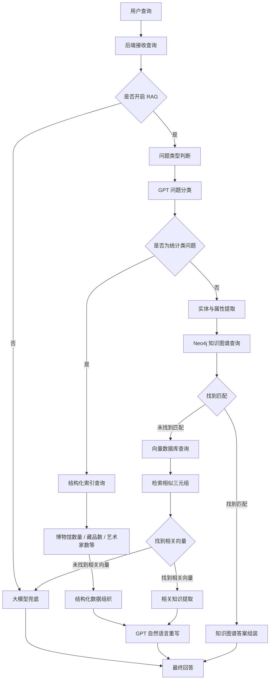
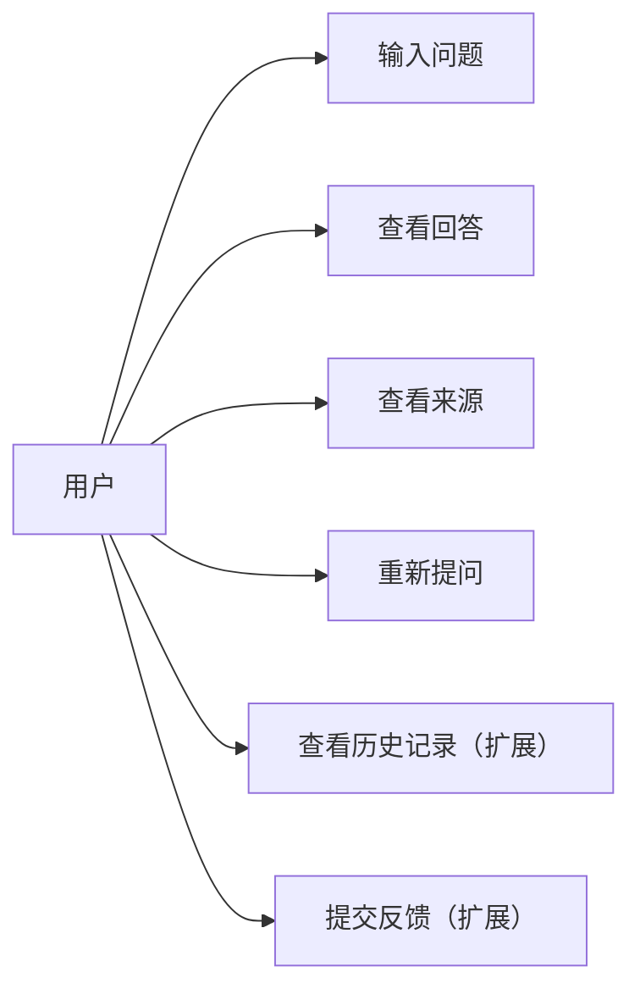
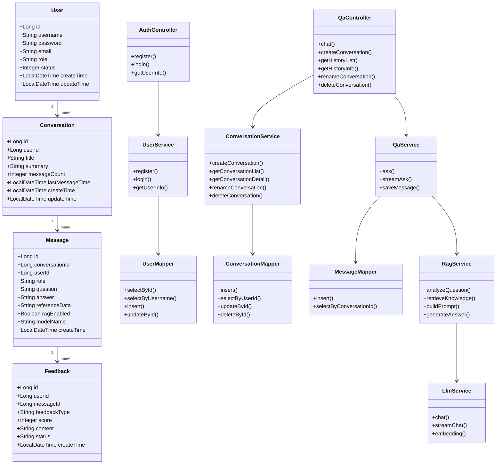
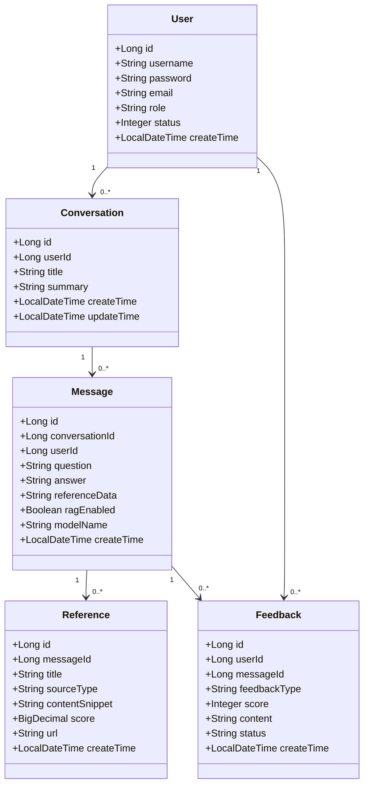
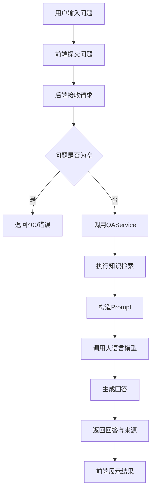
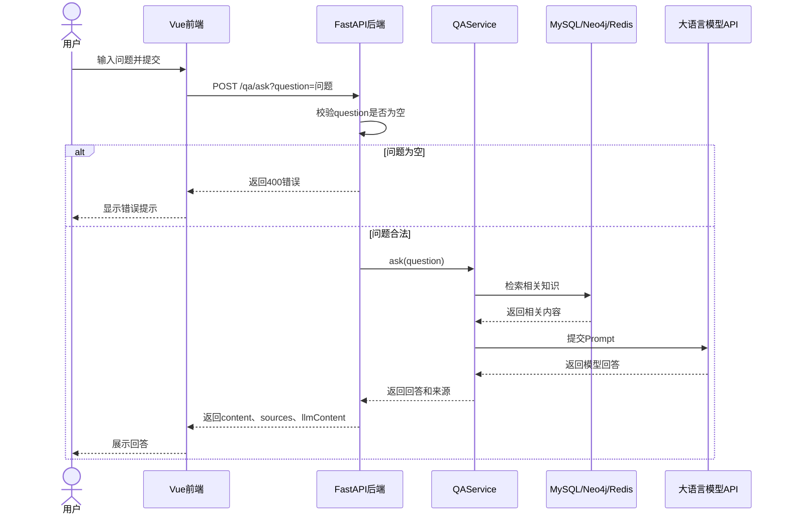

# 海外藏中国文物知识管理与服务平台——文博智问子系统需求规格说明书

## 1. 引言

### 1.1 编写目的

本文档是“海外藏中国文物知识管理与服务平台——文博智问子系统”的软件需求规格说明书，主要用于明确系统的建设目标、功能边界、业务流程、运行环境、接口约束、性能要求和非功能需求，为后续系统设计、编码实现、测试验收和运行维护提供依据。

“文博智问”子系统面向海外藏中国文物知识问答场景，旨在通过自然语言问答、知识检索、检索增强生成（RAG）和大语言模型调用等技术，为用户提供面向文物知识的智能问答服务。

通过本文档，项目相关人员可以对系统功能范围、实现约束、质量要求和后续扩展方向形成统一认识，从而降低沟通成本，提高开发、联调和验收效率。

### 1.2 项目背景

随着博物馆数字化、文物知识图谱和大语言模型技术的发展，传统关键词检索方式已经难以满足用户对文物知识获取的智能化需求。海外藏中国文物相关知识通常分布在不同文献、数据库、馆藏信息和结构化资料中，存在知识来源分散、查询门槛较高、检索结果不够直观等问题。

“文博智问”子系统通过构建面向文物知识的问答服务，使用户能够以自然语言方式提出问题，系统结合知识图谱、数据库、缓存数据和大语言模型生成回答，从而提升文物知识服务的便捷性、智能化程度和交互体验。

### 1.3 预期读者

本文档适用于以下人员阅读和使用：

- 项目负责人
- 前端开发人员
- 后端开发人员
- 算法与模型开发人员
- 测试人员
- 运维人员
- 文博知识维护人员
- 平台管理人员
- 项目评审人员

### 1.4 产品范围

#### 1.4.1 待开发软件系统

待开发软件系统为基于 B/S 架构的“文博智问”知识问答子系统。

该系统是海外藏中国文物知识管理与服务平台的重要组成部分，主要面向系统使用者提供自然语言提问、文物知识问答、RAG 增强回答、知识来源返回等功能。

#### 1.4.2 产品说明

“文博智问”子系统采用前后端分离架构，前端使用 Vue 工程提供用户交互界面，后端使用 Python/FastAPI 提供问答接口服务。后端通过调用知识图谱、关系型数据库、缓存服务和大语言模型接口完成问题处理、知识检索和回答生成。

系统的主要目标是让用户能够通过浏览器输入自然语言问题，系统根据问题内容从相关知识材料中检索信息，并结合大语言模型生成可读性较强的回答。

当前版本系统重点实现智能问答主流程，即：

1. 用户输入问题；
2. 前端提交问题；
3. 后端接收并校验问题；
4. 后端调用问答服务；
5. 系统执行知识检索与回答生成；
6. 前端展示回答内容及相关来源。

### 1.5 术语和缩略语

| 术语 | 全称 | 说明 |
|---|---|---|
| B/S | Browser/Server | 浏览器/服务器架构 |
| RAG | Retrieval-Augmented Generation | 检索增强生成，通过检索相关知识增强模型回答 |
| LLM | Large Language Model | 大语言模型 |
| API | Application Programming Interface | 应用程序接口 |
| FastAPI | FastAPI | Python Web 后端框架 |
| Vue | Vue.js | 前端 JavaScript 框架 |
| Neo4j | Neo4j Graph Database | 图数据库 |
| MySQL | MySQL Database | 关系型数据库 |
| Redis | Redis Cache | 缓存服务 |
| Prompt | Prompt | 提交给大语言模型的提示词与上下文 |
| Embedding | Embedding | 文本向量化表示 |

### 1.6 参考资料

- Vue 官方文档
- FastAPI 官方文档
- Neo4j 官方文档
- MySQL 官方文档
- Redis 官方文档
- OpenAI Compatible API 文档
- RAG 检索增强生成相关技术资料
- 项目代码仓库：`BUCT-CS2301/QAsystem`

---

## 2. 综合描述

### 2.1 产品概述

“文博智问”子系统是一个基于 Web 的智能问答系统。用户通过浏览器访问前端页面，输入与海外藏中国文物相关的问题，系统后端根据问题内容完成检索、推理和回答生成。

根据当前项目实现，系统由以下部分组成：

1. **前端应用**
   - 位于 `vue-project` 目录；
   - 负责页面展示、用户输入、请求发送和结果展示。

2. **后端服务**
   - 位于 `Rag_backend` 目录；
   - 采用 Python/FastAPI 实现；
   - 通过 `/qa/ask` 接口提供问答服务。

3. **知识与数据支撑**
   - MySQL：用于结构化数据支撑；
   - Neo4j：用于图谱关系查询；
   - Redis：用于缓存或中间结果管理；
   - 外部大语言模型 API：用于生成自然语言回答。

4. **配置管理**
   - 通过 `.env` 环境变量管理数据库、图数据库、缓存和模型服务配置；
   - 避免将敏感信息直接写入代码。

### 2.2 产品功能

当前版本系统应实现以下核心功能：

1. 用户自然语言提问；
2. 后端接收并校验问题；
3. RAG 检索增强处理；
4. 调用大语言模型生成回答；
5. 返回回答内容；
6. 返回相关知识来源信息；
7. 前端展示问答结果。

系统后续可扩展以下功能：

1. 多轮对话管理；
2. 历史记录保存；
3. 问答记录查询；
4. 用户反馈；
5. 答案来源可视化展示；
6. 用户登录与权限控制；
7. 管理端知识维护。

### 2.3 用户类和特性

当前版本系统采用无登录访问方式，不区分用户角色，所有使用者均通过统一入口访问问答功能。

| 用户类型 | 主要特征 | 使用目标 | 主要功能 |
|---|---|---|---|
| 普通使用者 | 通过浏览器访问系统，无需安装客户端 | 查询文物相关知识 | 输入问题、查看回答、查看来源 |
| 文博研究人员 | 关注知识准确性和来源依据 | 获取文物背景、馆藏和关系信息 | 提问、分析回答、参考来源 |
| 系统维护人员 | 负责系统运行与配置 | 维护后端服务和配置项 | 配置数据库、模型 API、运行环境 |

后续如引入登录机制，可进一步区分普通用户、管理员和知识维护人员等角色。

### 2.4 运行环境

#### 2.4.1 客户端环境

客户端通过浏览器访问系统，无需安装专用客户端软件。

推荐环境如下：

- 操作系统：
  - Windows 10 或以上；
  - macOS；
  - Linux；
  - Android；
  - iOS。

- 浏览器：
  - Chrome；
  - Edge；
  - Firefox；
  - Safari。

- 硬件要求：
  - CPU：双核及以上；
  - 内存：4GB 及以上；
  - 网络：支持稳定访问服务器。

#### 2.4.2 服务器环境

推荐服务器环境如下：

- 操作系统：Ubuntu 20.04/22.04 或其他 Linux 发行版；
- CPU：2 核及以上；
- 内存：4GB 及以上；
- 磁盘：40GB 及以上；
- 网络：具备访问外部模型服务的网络能力。

#### 2.4.3 软件环境

| 类型 | 要求 |
|---|---|
| 前端运行环境 | Node.js、npm |
| 前端框架 | Vue |
| 前端构建工具 | Vite |
| 后端语言 | Python |
| 后端框架 | FastAPI |
| 后端运行服务 | Uvicorn |
| 关系型数据库 | MySQL |
| 图数据库 | Neo4j |
| 缓存服务 | Redis |
| 模型服务 | DeepSeek / OpenAI Compatible API |
| 配置方式 | `.env` 环境变量 |

### 2.5 设计和实现限制

#### 2.5.1 技术限制

系统当前实现应遵循以下技术约束：

1. 前端采用 Vue 工程化开发；
2. 后端采用 Python/FastAPI 实现接口服务；
3. 问答接口通过 HTTP 方式对外提供；
4. 敏感配置通过环境变量管理；
5. 大语言模型调用依赖外部 API Key；
6. 系统暂未实现 JWT 登录鉴权机制；
7. 系统暂未实现完整用户角色权限体系。

#### 2.5.2 数据与服务限制

1. 若 Neo4j 服务不可用，图谱查询能力会受到影响；
2. 若 MySQL 服务不可用，结构化数据查询能力会受到影响；
3. 若 Redis 服务不可用，缓存相关能力会受到影响；
4. 若大语言模型 API 不可用，回答生成能力会受到影响；
5. 若 API Key 配置错误，模型调用将失败。

#### 2.5.3 输入限制

1. 用户问题不能为空；
2. 用户问题应去除首尾空白字符；
3. 单次问题长度建议不超过 1000 字符；
4. 系统应对异常输入返回明确错误提示。

---

## 3. 系统功能需求
#### 需求总览
| 编号 | 功能名称 | 优先级 | 当前状态 | 说明 |
|---|---|---|---|---|
| FR-001 | 用户提问 | 高 | 当前核心功能 | 用户输入自然语言问题 |
| FR-002 | 问题校验 | 高 | 当前核心功能 | 校验问题是否为空 |
| FR-003 | RAG 问答处理 | 高 | 当前核心功能 | 检索增强生成回答 |
| FR-004 | 模型回答生成 | 高 | 当前核心功能 | 调用外部大语言模型 |
| FR-005 | 回答结果返回 | 高 | 当前核心功能 | 返回回答文本 |
| FR-006 | 来源信息返回 | 中 | 当前支持/可扩展 | 返回相关知识来源 |
| FR-007 | 历史对话管理 | 中 | 后续扩展 | 保存与查看历史记录 |
| FR-008 | 多轮对话 | 中 | 后续扩展 | 支持上下文追问 |
| FR-009 | 用户反馈 | 低 | 后续扩展 | 点赞、点踩、纠错 |
| FR-010 | 登录鉴权 | 低 | 后续扩展 | 当前未实现 JWT |

### 3.1 系统工作流程分析 

1. 用户输入问题，系统首先尝试从问题中提取实体和属性。
2. 如果成功提取，系统尝试使用 Neo4j 图数据库查询相关信息。
3. 如果图数据库查询成功，系统直接返回结构化知识。
4. 如果上述步骤失败，系统使用 RAG 增强功能：
   - 首先对问题进行分类。
   - 如果是统计类问题，使用结构化索引处理。
   - 否则，使用向量检索找到相关知识。
   - 将检索到的知识与用户问题结合，调用大语言模型生成回答。
5. 如果 RAG 增强也失败，系统直接使用大语言模型生成回答。
6. 系统记录问答历史，供用户后续查看和继续对话。

#### 3.1.1 系统工作流程图

---

### 3.2 系统用例分析

### 3.2.1 系统用例图

### 3.2.2 用例：输入问题

| 项目 | 内容 |
|---|---|
| 用例编号 | UC-001 |
| 用例名称 | 输入问题 |
| 参与者 | 用户 |
| 简要描述 | 用户在系统中输入自然语言问题并提交 |
| 前置条件 | 用户已进入问答页面 |
| 后置条件 | 系统接收到问题并开始处理 |
| 基本流程 | 1. 用户输入问题；2. 用户点击提交；3. 前端发送请求；4. 后端接收问题 |
| 异常流程 | 若问题为空，系统提示用户输入有效问题 |
| 优先级 | 高 |

### 3.2.3 用例：查看回答

| 项目 | 内容 |
|---|---|
| 用例编号 | UC-002 |
| 用例名称 | 查看回答 |
| 参与者 | 用户 |
| 简要描述 | 用户查看系统返回的回答内容 |
| 前置条件 | 用户已提交合法问题 |
| 后置条件 | 前端展示回答 |
| 基本流程 | 1. 后端返回回答；2. 前端解析结果；3. 页面展示回答内容 |
| 异常流程 | 若生成失败，页面展示错误提示 |
| 优先级 | 高 |

### 3.2.4 用例：查看来源

| 项目 | 内容 |
|---|---|
| 用例编号 | UC-003 |
| 用例名称 | 查看来源 |
| 参与者 | 用户 |
| 简要描述 | 用户查看回答相关的知识来源 |
| 前置条件 | 回答结果中包含来源信息 |
| 后置条件 | 用户了解回答参考依据 |
| 基本流程 | 1. 系统返回 sources；2. 前端展示来源列表；3. 用户查看来源内容 |
| 异常流程 | 若无来源信息，提示“暂无来源信息” |
| 优先级 | 中 |

### 3.3 系统类图及实体类属性

#### 3.3.1 类图 

#### 3.3.2 主要类

主要类包括：

1. `User`：用户实体类，用于描述系统用户的基础信息。
2. `Conversation`：对话实体类，用于描述用户创建的会话。
3. `Message`：问答消息实体类，用于保存用户问题、AI 回答和参考来源。
4. `Feedback`：反馈实体类，用于保存用户对回答的评价和纠错意见。
5. `AuthController`：用户控制器，负责注册和用户信息查询等接口。
6. `QaController`：问答控制器，负责对话管理和问答请求处理。
7. `UserService`：用户业务服务，负责用户注册和用户信息查询逻辑。
8. `ConversationService`：对话业务服务，负责会话创建、查询、重命名和删除。
9. `QaService`：问答业务服务，负责问题处理、答案生成和记录保存。
10. `RagService`：检索增强服务，负责问题分析、知识检索和 Prompt 构造。
11. `LlmService`：大语言模型服务，负责调用外部模型接口生成回答。
12. `UserMapper`：用户数据访问接口。
13. `ConversationMapper`：会话数据访问接口。
14. `MessageMapper`：消息数据访问接口。

#### 3.3.3 系统实体关系类图

#### 3.3.4 系统类属性

主要实体类属性如下：

1. `User`：用户实体类  
    - `id`：用户 ID
    - `username`：用户名
    - `password`：加密后的密码
    - `email`：用户邮箱
    - `accessTag`：访问标识
    - `status`：用户状态
    - `createTime`：创建时间
    - `updateTime`：更新时间

2. `Conversation`：对话实体类  
   - `id`：对话 ID
   - `userId`：所属用户 ID
   - `title`：对话标题
   - `summary`：对话摘要
   - `messageCount`：消息数量
   - `lastMessageTime`：最后消息时间
   - `createTime`：创建时间
   - `updateTime`：更新时间

3. `Message`：问答消息实体类  
   - `id`：消息 ID
   - `conversationId`：所属对话 ID
   - `userId`：所属用户 ID
   - `role`：消息角色，包括 user、assistant、system
   - `question`：用户问题
   - `answer`：系统回答
   - `referenceData`：答案引用来源
   - `ragEnabled`：是否启用 RAG
   - `modelName`：调用模型名称
   - `responseTime`：响应耗时
   - `createTime`：创建时间

4. `Reference`：引用来源实体类  
   - `id`：引用来源 ID
   - `messageId`：所属消息 ID
   - `title`：来源标题
   - `sourceType`：来源类型
   - `sourceId`：来源对象 ID
   - `contentSnippet`：引用内容片段
   - `score`：相关性得分
   - `url`：来源链接
   - `createTime`：创建时间

5. `Feedback`：用户反馈实体类  
   - `id`：反馈 ID
   - `userId`：反馈用户 ID
   - `messageId`：对应消息 ID
   - `feedbackType`：反馈类型，如点赞、点踩、纠错
   - `score`：评分
   - `content`：反馈内容
   - `status`：处理状态
   - `createTime`：创建时间
   - `updateTime`：更新时间

### 3.4 用例描述

#### 表 3.4.1 “提问问题”用例描述

| 项目 | 内容 |
|---|---|
| 用例名 | 提问问题 |
| 用例编号 | UC101 |
| 简要描述 | 用户通过该用例向系统提交问题，获取答案。 |
| 参与者 | 用户 |
| 涉众 | 用户：完成问题提交。 系统：处理问题并生成回答。 |
| 相关用例 | 创建对话、查看历史对话 |
| 前置条件 | 用户已进入系统并且已创建或选择一个对话。 |
| 后置条件 | 系统生成回答并保存问答记录。 |
| 基本事件流 | 1. 用户输入问题并提交 2. 系统处理问题并生成回答 3. 系统显示回答给用户 4. 系统保存问答记录到历史表 |
| 备选事件流 | A-1 系统无法生成回答 1. 系统提示无法回答该问题 2. 用户可以重新提问或结束用例 |
| 补充约束 | B-1 问题不能为空 B-2 问题长度不应超过 1000 字符 B-3 系统应在合理时间内返回回答 |
| 待解决问题 | 无 |

#### 表 3.4.2 “查看历史对话”用例描述

| 项目 | 内容 |
|---|---|
| 用例名 | 查看历史对话 |
| 用例编号 | UC102 |
| 简要描述 | 用户通过该用例查看历史对话内容。 |
| 参与者 | 用户 |
| 涉众 | 用户：查看历史对话内容。 |
| 相关用例 | 提问问题、创建对话 |
| 前置条件 | 用户已进入系统且有历史对话记录。 |
| 后置条件 | 系统显示历史对话内容。 |
| 基本事件流 | 1. 用户选择一个历史对话 2. 系统获取该对话的所有问答记录 3. 系统按时间顺序展示问答内容 |
| 备选事件流 | A-1 没有查询到历史记录 1. 系统提示没有历史对话记录 2. 用户可以创建新对话或结束用例 |
| 补充约束 | B-1 系统应支持分页显示历史记录 B-2 系统应显示问答时间信息 |
| 待解决问题 | 无 |

---

#### 表 3.4.4 “创建新对话”用例描述

| 项目 | 内容 |
|---|---|
| 用例名 | 创建新对话 |
| 用例编号 | UC104 |
| 简要描述 | 用户创建一个新的问答会话，用于开始新的主题问答。 |
| 参与者 | 用户 |
| 涉众 | 用户：开始新的问答主题。 系统：创建并保存新的对话记录。 |
| 相关用例 | 提问问题、查看历史对话 |
| 前置条件 | 用户可访问系统。 |
| 后置条件 | 系统生成新的对话 ID，并在历史列表中显示。 |
| 基本事件流 | 1. 用户点击“新建对话”按钮 2. 系统创建默认标题的对话 3. 系统保存对话记录 4. 前端切换到新对话页面 |
| 备选事件流 | A-1 创建失败 1. 系统提示创建失败 2. 用户可稍后重试 |
| 补充约束 | B-1 对话标题不能为空 B-2 默认标题可使用“新对话”或问题摘要生成 |
| 待解决问题 | 无 |

#### 表 3.4.5 “提交反馈”用例描述

| 项目 | 内容 |
|---|---|
| 用例名 | 提交反馈 |
| 用例编号 | UC105 |
| 简要描述 | 用户对系统生成的回答进行评价或提交纠错意见。 |
| 参与者 | 用户 |
| 涉众 | 用户：表达对回答质量的评价。 系统：记录反馈信息，用于后续优化。 |
| 相关用例 | 查看回答、查看答案来源 |
| 前置条件 | 用户已获得系统生成的回答。 |
| 后置条件 | 系统保存用户反馈记录。 |
| 基本事件流 | 1. 用户点击点赞、点踩或纠错按钮 2. 用户可填写反馈内容 3. 系统保存反馈信息 4. 系统提示反馈提交成功 |
| 备选事件流 | A-1 反馈提交失败 1. 系统提示提交失败 2. 用户可重新提交 |
| 补充约束 | B-1 反馈内容长度不超过 1000 字 B-2 每条回答允许用户提交一次或多次反馈，具体规则由系统配置确定 |
| 待解决问题 | 无 |

## 3.5 系统业务流程

### 3.5.1 核心问答流程

### 3.5.2 问答接口顺序图

### 3.5.3 异常流程

| 异常场景 | 处理逻辑 | 用户提示 |
|---|---|---|
| 问题为空 | 返回 400 错误 | 请输入有效问题 |
| 模型 API Key 缺失 | 后端记录错误并返回失败 | 模型服务配置异常 |
| 模型调用超时 | 返回超时提示 | 回答生成超时，请稍后重试 |
| 数据库连接失败 | 返回服务异常 | 知识服务暂不可用 |
| 图数据库连接失败 | 使用其他检索结果或返回异常 | 知识图谱服务暂不可用 |
| 网络异常 | 前端显示失败状态 | 网络异常，请稍后重试 |

---

## 4. 非功能需求

### 4.1 界面需求

1. 页面应简洁清晰，突出问题输入和回答展示；
2. 用户应能快速定位输入框并提交问题；
3. 系统应显示加载状态，避免用户误认为系统无响应；
4. 回答内容应具有良好的可读性；
5. 来源信息应以清晰方式展示；
6. 错误提示应使用用户可理解的语言；
7. 页面应适配常见桌面浏览器；
8. 后续可支持移动端响应式布局。

### 4.2 性能需求

| 项目 | 要求 |
|---|---|
| 普通接口响应 | 95% 请求应在 3 秒内完成，不含模型生成耗时 |
| 复杂问答响应 | 建议 95% 请求在 15 秒内完成 |
| 空问题校验 | 应在 1 秒内返回 |
| 模型调用超时 | 应设置合理超时时间 |
| 并发能力 | 当前阶段支持课程演示和小规模并发访问 |

说明：由于大语言模型调用受外部服务影响，复杂问答响应时间可能受到模型服务网络状态和模型生成速度影响。

### 4.3 可靠性需求

1. 系统应能稳定启动后端服务；
2. 配置缺失时应给出明确错误提示；
3. 外部服务异常不应导致后端进程崩溃；
4. 数据库连接失败时应返回可解释错误；
5. 模型调用失败时应返回失败提示；
6. 前端应能处理后端错误响应。

### 4.4 安全需求

#### 4.4.1 当前版本安全要求

1. API Key、数据库密码等敏感配置不得硬编码；
2. 敏感配置应通过环境变量管理；
3. 前端不得暴露模型 API Key；
4. 后端应校验用户输入；
5. 错误响应不应暴露数据库连接串、密钥或堆栈细节。

#### 4.4.2 后续扩展安全要求

后续如系统面向公网或多用户使用，应增加：

1. 登录认证；
2. Token 或 JWT 鉴权；
3. 用户权限控制；
4. 请求频率限制；
5. 操作审计日志；
6. HTTPS 访问；
7. API Key 安全托管。

### 4.5 可维护性需求

1. 前端和后端应保持目录结构清晰；
2. 问答逻辑应与接口入口解耦；
3. 配置项应集中管理；
4. 代码应具备必要注释；
5. 依赖项应通过 `requirements.txt` 和 `package.json` 管理；
6. 后续新增功能应尽量以模块化方式扩展。

### 4.6 可扩展性需求

系统后续应支持以下扩展：

1. 增加新的知识来源；
2. 替换或增加新的大语言模型；
3. 增加向量检索能力；
4. 增加多轮对话能力；
5. 增加历史记录管理；
6. 增加用户反馈机制；
7. 增加登录鉴权；
8. 增加管理端功能。

### 4.7 兼容性需求

1. 前端应兼容主流现代浏览器；
2. 后端应支持 Linux 服务器部署；
3. 数据库连接配置应支持本地和远程服务；
4. 模型服务应兼容 OpenAI API 风格接口。

---

