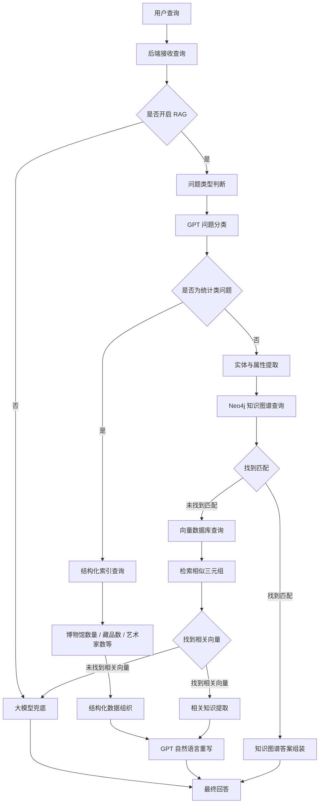
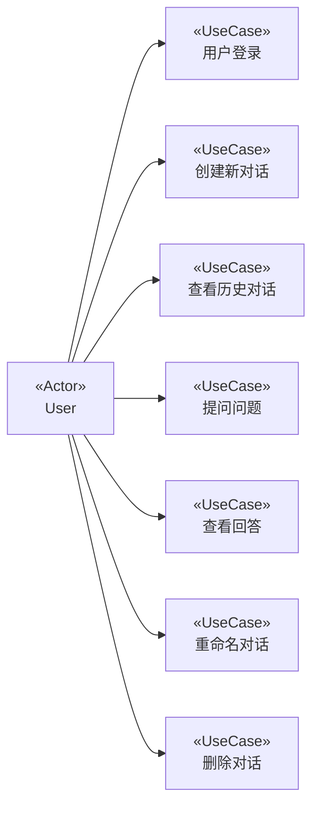
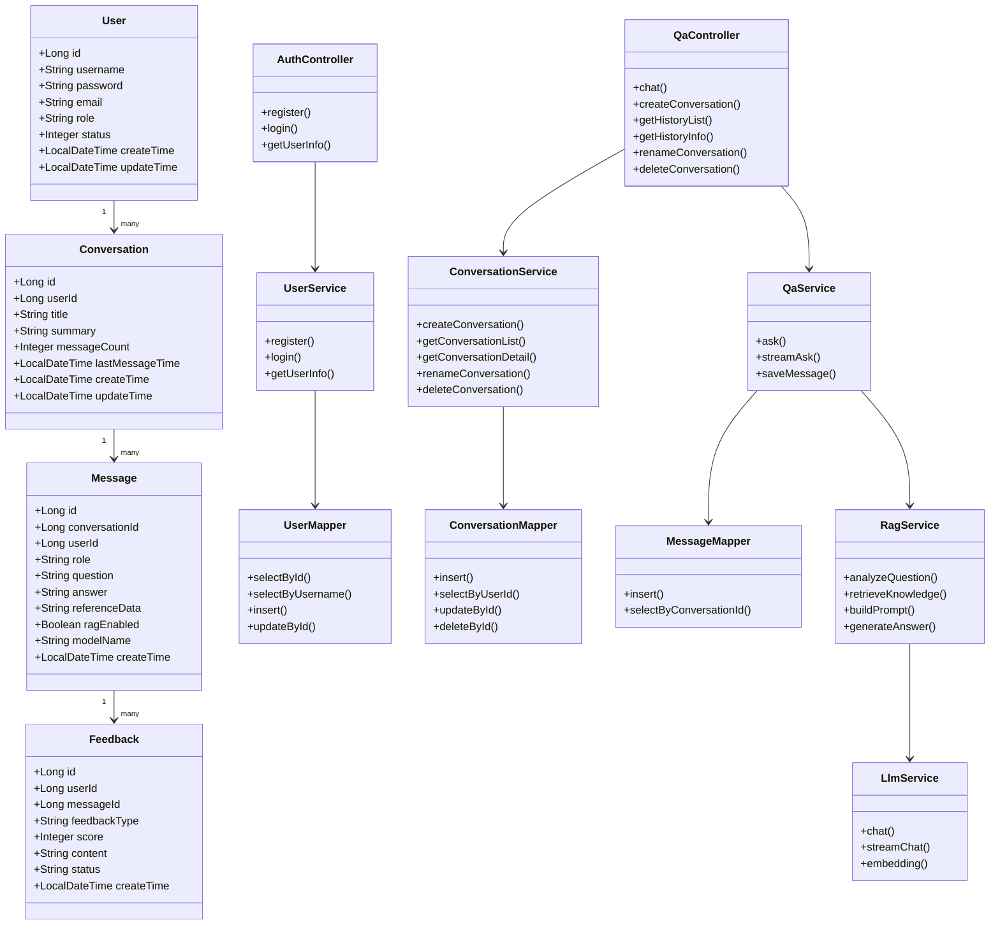
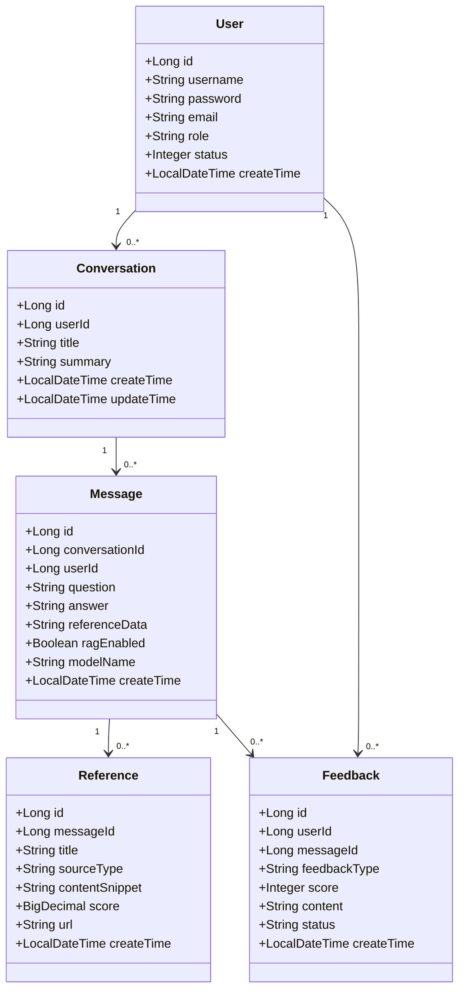
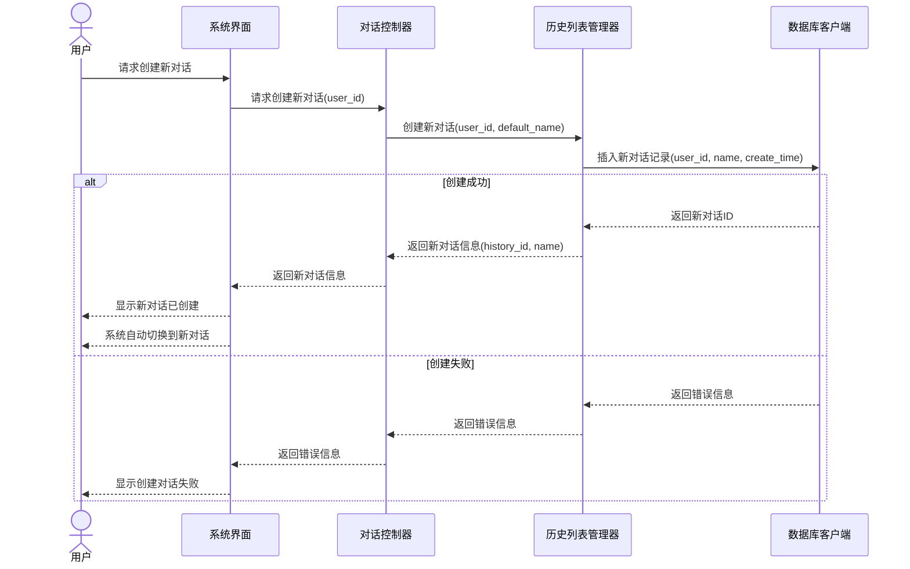

# 文博智问子系统 需求规格说明书

## 1. 引言

### 1.1 编写目的

本文档是关于“文博智问”知识问答子系统的软件需求规格说明书，主要用于明确系统的建设目标、功能需求、性能需求、运行环境、用户角色、业务流程、接口约束和非功能性需求，为后续系统设计、编码实现、测试验收和运维管理提供依据。

本系统面向海外藏中国文物知识管理与服务平台，旨在通过自然语言问答、多轮对话、知识检索、历史记录管理和答案来源展示等功能，为用户提供高效、准确、可追溯的文物知识服务。系统采用 B/S 架构，前端使用 Vue 3，后端使用 Spring Boot，数据库使用 MySQL，并可结合知识图谱、向量检索和大语言模型实现智能问答能力。

通过本需求规格说明书，可以使项目相关人员对系统功能边界、用户需求、运行约束和质量要求形成统一认识，从而降低沟通成本，提高系统开发和测试的准确性。

### 1.2 预期读者

本软件产品需求分析报告预期读者：

- 项目负责人、产品经理
- 前端开发人员、后端开发人员、算法工程师
- 测试人员、运维人员
- 文物领域专家、知识库维护人员
- 平台管理人员

### 1.3 产品范围

#### 1.3.1 待开发软件系统

待开发软件系统：基于 B/S 结构的“文博智问”知识问答子系统。

该系统是海外藏中国文物知识管理与服务平台的重要组成部分，主要面向普通用户、研究人员、文物领域专家和平台管理员，提供自然语言问答、文物知识查询、多轮对话、历史记录管理、答案来源展示和用户反馈等功能。

#### 1.3.2 产品说明

“文博智问”知识问答子系统作为一种现代化的文物知识服务系统，是海外藏中国文物知识管理与服务平台智能化建设的重要组成部分。

该系统通过前端交互界面、后端业务服务、关系型数据库和智能问答能力的结合，实现面向文物知识的自然语言查询。用户可以通过浏览器输入问题，系统根据用户问题检索相关文物知识、历史背景、馆藏信息和文献资料，并生成结构化、通俗化、可追溯的回答。

系统的应用将使文物知识服务更加智能化、个性化和高效化，避免传统关键词检索方式存在的信息零散、检索效率低、知识理解门槛高等问题，提高文物知识传播、研究和服务的效率。

### 1.4 参考文献

- Spring Boot 官方文档
- RAG (Retrieval-Augmented Generation) 技术白皮书
- OpenAI GPT API 开发文档
- 博物馆数字化知识服务研究报告
- MySQL 官方文档
- 博物馆数字化知识服务研究报告

---

## 2. 综合描述

本系统基于 B/S 结构开发，前端采用 Vue 3 构建用户交互界面，后端采用 Spring Boot 构建业务服务，关系型数据库采用 MySQL 存储用户信息、对话记录、问答历史和反馈数据。系统可根据业务需要接入 Neo4j 知识图谱、Milvus 向量数据库和大语言模型服务，实现基于 RAG 的智能问答能力。

用户无需安装客户端软件，只需通过浏览器访问系统即可完成登录、提问、查看回答、管理历史对话等操作。系统的数据处理、知识检索、模型调用和记录保存均由服务器端完成。

### 2.1 产品的功能

1. 用户认证与授权
2. 多轮对话管理
3. 博物馆文物知识问答
4. 文物属性查询（作者、年代、特点等）
5. 统计类问题解答
6. 对话历史管理
7. RAG 增强回答

### 2.2 用户类和特性

| 用户类型 | 主要特征 | 主要权限 |
| :-- | :-- | :-- |
| 普通用户 | 使用系统进行文物知识查询和学习 | 提问、查看回答、管理个人对话历史 |
| 研究人员 | 关注知识准确性、来源和关联分析 | 深度查询、查看参考来源、提交纠错建议 |
| 管理员 | 负责系统运行和内容管理 | 用户管理、知识库维护、模型配置、数据审核 |
| 领域专家 | 负责文物知识校验和专业审核 | 知识审核、反馈处理、内容修订建议 |

### 2.3 运行环境

本系统采用 B/S 架构，用户通过浏览器访问系统，主要计算和数据处理由服务器端完成。系统运行环境包括客户端环境、服务器环境、数据库环境和外部服务环境。

#### 2.3.1 硬件平台

##### 客户端

- 普通 PC、平板或移动设备
- CPU：双核处理器或更高
- 内存：4GB 或更高
- 分辨率：1280×720 或更高
- 网络：支持互联网访问

##### 服务器端

- CPU：8 核或以上
- 内存：16GB 或以上
- 硬盘：500GB 或以上
- 网络：稳定公网或内网访问环境

#### 2.3.2 操作系统

客户端支持：

- Windows 10 或以上
- macOS
- Linux
- Android
- iOS

服务器端支持：

- Linux CentOS 7 或以上
- Ubuntu 20.04 或以上
- Windows Server 2016 或以上

#### 2.3.3 支撑环境和版本

- 前端运行环境：Node.js 18 或以上
- 前端框架：Vue 3
- 构建工具：Vite
- UI 组件库：Element Plus
- 后端运行环境：JDK 17 或以上
- 后端框架：Spring Boot 3.x
- ORM 框架：MyBatis-Plus / MyBatis
- 关系型数据库：MySQL 8.0 或以上
- 缓存服务：Redis，可选
- 图数据库：Neo4j 4.4 或以上，可选
- 向量数据库：Milvus 2.0 或以上，可选
- 大语言模型服务：DeepSeek / OpenAI Compatible API
- Web 服务器：Nginx
- 部署方式：Docker / Docker Compose，可选

### 2.4 设计和实现上的限制

#### 1. 必须使用的特定技术、工具、编程语言和数据库

- 前端框架：Vue 3
- UI 组件库：Element Plus
- 状态管理：Pinia
- 路由管理：Vue Router
- 后端框架：Spring Boot
- 后端开发语言：Java
- 数据库：MySQL
- ORM 框架：MyBatis-Plus / MyBatis
- 认证机制：JWT
- 接口风格：RESTful API
- 流式响应：SSE，可选
- 部署环境：Nginx、Docker，可选

#### 2. 可选集成技术

- Neo4j：用于文物知识图谱查询
- Milvus：用于文本向量检索
- Redis：用于缓存热点数据或会话状态
- 大语言模型 API：用于生成自然语言回答
- 向量嵌入模型：用于将问题和知识文本转化为向量表示

#### 3. 运行限制

- 系统需要稳定的网络连接，以保证前后端通信和外部模型服务调用。
- 若使用大语言模型 API，需要提前配置合法有效的 API Key。
- 若使用向量检索，需要保证向量索引构建完成并定期维护。
- 若使用知识图谱，需要保证图谱数据结构完整、实体关系可查询。
- 系统响应时间应控制在合理范围内，避免用户长时间等待。
- 用户输入内容需要进行长度限制和安全过滤，防止恶意请求。

## 3. 系统功能需求

### 3.1 系统工作流程分析

1. 用户登录系统，可以创建新对话或查看历史对话。
2. 用户输入问题，系统首先尝试从问题中提取实体和属性。
3. 如果成功提取，系统尝试使用 Neo4j 图数据库查询相关信息。
4. 如果图数据库查询成功，系统直接返回结构化知识。
5. 如果上述步骤失败，系统使用 RAG 增强功能：
   - 首先对问题进行分类。
   - 如果是统计类问题，使用结构化索引处理。
   - 否则，使用向量检索找到相关知识。
   - 将检索到的知识与用户问题结合，调用大语言模型生成回答。
6. 如果 RAG 增强也失败，系统直接使用大语言模型生成回答。
7. 系统记录问答历史，供用户后续查看和继续对话。

#### 3.1.1 系统工作流程图

---

### 3.2 系统用例分析

#### 3.2.1 系统用例图

#### 3.2.2 主要用例

主要用例包括：

1. 用户登录
2. 创建新对话
3. 查看历史对话
4. 提问问题
5. 查看回答
6. 重命名对话
7. 删除对话

---

### 3.3 系统类图及实体类属性

#### 3.3.1 类图 (根据最终的数据库修改)

#### 3.3.2 主要类

主要类包括：

1. `User`：用户实体类，用于描述系统用户的基础信息。
2. `Conversation`：对话实体类，用于描述用户创建的会话。
3. `Message`：问答消息实体类，用于保存用户问题、AI 回答和参考来源。
4. `Feedback`：反馈实体类，用于保存用户对回答的评价和纠错意见。
5. `AuthController`：认证控制器，负责注册、登录、用户信息查询等接口。
6. `QaController`：问答控制器，负责对话管理和问答请求处理。
7. `UserService`：用户业务服务，负责用户注册、登录和认证逻辑。
8. `ConversationService`：对话业务服务，负责会话创建、查询、重命名和删除。
9. `QaService`：问答业务服务，负责问题处理、答案生成和记录保存。
10. `RagService`：检索增强服务，负责问题分析、知识检索和 Prompt 构造。
11. `LlmService`：大语言模型服务，负责调用外部模型接口生成回答。
12. `UserMapper`：用户数据访问接口。
13. `ConversationMapper`：会话数据访问接口。
14. `MessageMapper`：消息数据访问接口。

#### 3.3.3 系统实体关系类图

#### 3.3.4 系统类属性

主要实体类属性如下：

1. `User`：用户实体类  
   - `id`：用户 ID
   - `username`：用户名
   - `password`：加密后的密码
   - `email`：用户邮箱
   - `role`：用户角色
   - `status`：用户状态
   - `createTime`：创建时间
   - `updateTime`：更新时间

2. `Conversation`：对话实体类  
   - `id`：对话 ID
   - `userId`：所属用户 ID
   - `title`：对话标题
   - `summary`：对话摘要
   - `messageCount`：消息数量
   - `lastMessageTime`：最后消息时间
   - `createTime`：创建时间
   - `updateTime`：更新时间

3. `Message`：问答消息实体类  
   - `id`：消息 ID
   - `conversationId`：所属对话 ID
   - `userId`：所属用户 ID
   - `role`：消息角色，包括 user、assistant、system
   - `question`：用户问题
   - `answer`：系统回答
   - `referenceData`：答案引用来源
   - `ragEnabled`：是否启用 RAG
   - `modelName`：调用模型名称
   - `responseTime`：响应耗时
   - `createTime`：创建时间

4. `Reference`：引用来源实体类  
   - `id`：引用来源 ID
   - `messageId`：所属消息 ID
   - `title`：来源标题
   - `sourceType`：来源类型
   - `sourceId`：来源对象 ID
   - `contentSnippet`：引用内容片段
   - `score`：相关性得分
   - `url`：来源链接
   - `createTime`：创建时间

5. `Feedback`：用户反馈实体类  
   - `id`：反馈 ID
   - `userId`：反馈用户 ID
   - `messageId`：对应消息 ID
   - `feedbackType`：反馈类型，如点赞、点踩、纠错
   - `score`：评分
   - `content`：反馈内容
   - `status`：处理状态
   - `createTime`：创建时间
   - `updateTime`：更新时间

### 3.4 用例描述

#### 表 3.4.1 “提问问题”用例描述

| 项目 | 内容 |
|---|---|
| 用例名 | 提问问题 |
| 用例编号 | UC101 |
| 简要描述 | 用户通过该用例向系统提交问题，获取答案。 |
| 参与者 | 用户 |
| 涉众 | 用户：完成问题提交。 系统：处理问题并生成回答。 |
| 相关用例 | 创建对话、查看历史对话 |
| 前置条件 | 用户已登录系统并且已创建或选择一个对话。 |
| 后置条件 | 系统生成回答并保存问答记录。 |
| 基本事件流 | 1. 用户输入问题并提交 2. 系统处理问题并生成回答 3. 系统显示回答给用户 4. 系统保存问答记录到历史表 |
| 备选事件流 | A-1 系统无法生成回答 1. 系统提示无法回答该问题 2. 用户可以重新提问或结束用例 |
| 补充约束 | B-1 问题不能为空 B-2 问题长度不应超过 1000 字符 B-3 系统应在合理时间内返回回答 |
| 待解决问题 | 无 |

#### 表 3.4.2 “查看历史对话”用例描述

| 项目 | 内容 |
|---|---|
| 用例名 | 查看历史对话 |
| 用例编号 | UC102 |
| 简要描述 | 用户通过该用例查看历史对话内容。 |
| 参与者 | 用户 |
| 涉众 | 用户：查看历史对话内容。 |
| 相关用例 | 提问问题、创建对话 |
| 前置条件 | 用户已登录系统且有历史对话记录。 |
| 后置条件 | 系统显示历史对话内容。 |
| 基本事件流 | 1. 用户选择一个历史对话 2. 系统获取该对话的所有问答记录 3. 系统按时间顺序展示问答内容 |
| 备选事件流 | A-1 没有查询到历史记录 1. 系统提示没有历史对话记录 2. 用户可以创建新对话或结束用例 |
| 补充约束 | B-1 系统应支持分页显示历史记录 B-2 系统应显示问答时间信息 |
| 待解决问题 | 无 |

---

#### 表 3.4.3 “用户登录”用例描述

| 项目 | 内容 |
|---|---|
| 用例名 | 用户登录 |
| 用例编号 | UC103 |
| 简要描述 | 用户通过用户名和密码登录系统，获取访问权限。 |
| 参与者 | 普通用户、研究人员、管理员、领域专家 |
| 涉众 | 用户：获得系统使用权限。 系统：完成身份验证并生成 Token。 |
| 相关用例 | 用户注册、获取用户信息 |
| 前置条件 | 用户已经注册账号。 |
| 后置条件 | 用户登录成功，系统返回 JWT Token。 |
| 基本事件流 | 1. 用户输入用户名和密码 2. 系统校验用户名和密码 3. 校验通过后生成 JWT Token 4. 前端保存 Token 并跳转到系统主页 |
| 备选事件流 | A-1 用户名或密码错误 1. 系统返回登录失败提示 2. 用户重新输入登录信息 |
| 补充约束 | B-1 用户名和密码不能为空 B-2 密码传输应通过 HTTPS 加密 B-3 登录失败次数过多时应进行限制 |
| 待解决问题 | 无 |

#### 表 3.4.4 “创建新对话”用例描述

| 项目 | 内容 |
|---|---|
| 用例名 | 创建新对话 |
| 用例编号 | UC104 |
| 简要描述 | 用户创建一个新的问答会话，用于开始新的主题问答。 |
| 参与者 | 用户 |
| 涉众 | 用户：开始新的问答主题。 系统：创建并保存新的对话记录。 |
| 相关用例 | 提问问题、查看历史对话 |
| 前置条件 | 用户已登录系统。 |
| 后置条件 | 系统生成新的对话 ID，并在历史列表中显示。 |
| 基本事件流 | 1. 用户点击“新建对话”按钮 2. 系统创建默认标题的对话 3. 系统保存对话记录 4. 前端切换到新对话页面 |
| 备选事件流 | A-1 创建失败 1. 系统提示创建失败 2. 用户可稍后重试 |
| 补充约束 | B-1 对话标题不能为空 B-2 默认标题可使用“新对话”或问题摘要生成 |
| 待解决问题 | 无 |

#### 表 3.4.5 “提交反馈”用例描述

| 项目 | 内容 |
|---|---|
| 用例名 | 提交反馈 |
| 用例编号 | UC105 |
| 简要描述 | 用户对系统生成的回答进行评价或提交纠错意见。 |
| 参与者 | 普通用户、研究人员、领域专家 |
| 涉众 | 用户：表达对回答质量的评价。 系统：记录反馈信息，用于后续优化。 |
| 相关用例 | 查看回答、查看答案来源 |
| 前置条件 | 用户已登录，且系统已生成回答。 |
| 后置条件 | 系统保存用户反馈记录。 |
| 基本事件流 | 1. 用户点击点赞、点踩或纠错按钮 2. 用户可填写反馈内容 3. 系统保存反馈信息 4. 系统提示反馈提交成功 |
| 备选事件流 | A-1 反馈提交失败 1. 系统提示提交失败 2. 用户可重新提交 |
| 补充约束 | B-1 反馈内容长度不超过 1000 字 B-2 每条回答允许用户提交一次或多次反馈，具体规则由系统配置确定 |
| 待解决问题 | 无 |

### 3.5 系统处理功能分析

#### 3.5.1 提问用例顺序图(根据最终功能修改)

#### 3.5.2 创建对话顺序图

---

## 4. 其它非功能需求

### 4.1 界面需求

1. 页面内容：主题突出、操作方便、术语和行文格式统一、规范、明确。每一个系统用户拥有事先分配好的用户名和密码，不同类型的用户只能访问各自工作领域内的相关页面。
2. 页面结构摆放合理，方便用户使用。
3. 技术环境：页面大小适中，响应式设计，适应不同设备屏幕。
4. 界面应支持流式输出回答，提供良好的用户体验。

### 4.2 响应时间需求

用户登录，进行任何操作的时候，系统应该及时地进行反应，对于简单查询，反应的时间应在 3 秒以内；对于复杂问题的回答，首字输出应在 5 秒内开始。

系统应能检测出各种非正常情况，如与设备的通信中断，无法连接数据库服务器等，以避免出现长时间等待甚至无响应。

### 4.3 可靠性需求

本系统是在 Internet 上进行服务的，主要的系统数据都要通过 Internet 在客户端和服务器之间进行传输，这样就很难保证系统信息不会遭到恶意的破坏，这就需要我们要尽量的对数据进行加密保护。

另一方面，本系统是一个多用户系统，这就有管理员和普通用户的区分，这也需要我们在系统中对不同人员的使用权限进行区分，不同的使用人员所能访问的资源是不同的。这两方面就保证了系统的可靠性。

### 4.4 开放性需求

系统应具有较强的灵活性，以适应将来功能扩展的需求。尤其是在知识库扩展、模型升级、新功能添加方面，应具备良好的开放性。

### 4.5 可扩展性需求

一个系统在被使用了一段时间后，使用者都会对系统提出很多的改进意见，这就要求我们编写的系统要有很好的可扩展性。

本系统由于是采用模块化设计，所以当用户提出改进意见后，开发人员只需要在服务器端把相应的模块改写或添加新模块，就会改变系统中相应部分的功能。

系统应支持：

1. 新知识来源的扩展
2. 新 LLM 模型的集成
3. 新检索算法的接入
4. 新博物馆资源的添加

### 4.6 系统安全需求

系统需要严格的权限管理功能，各功能模块需要相应的权限方能进入。系统需能够防止各类误操作能造成的数据丢失、破坏。防止不法用户盗取重要信息。特别是 API 密钥等敏感信息需要严格保护，避免泄露和滥用。