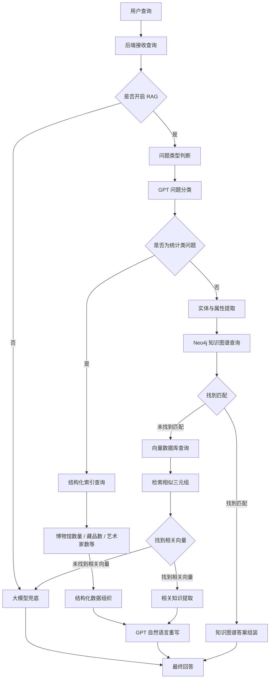
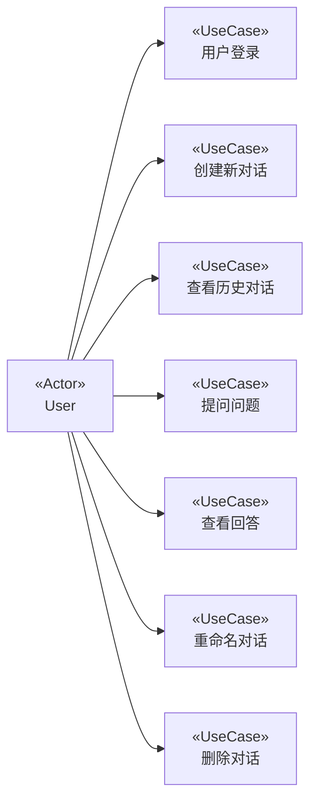
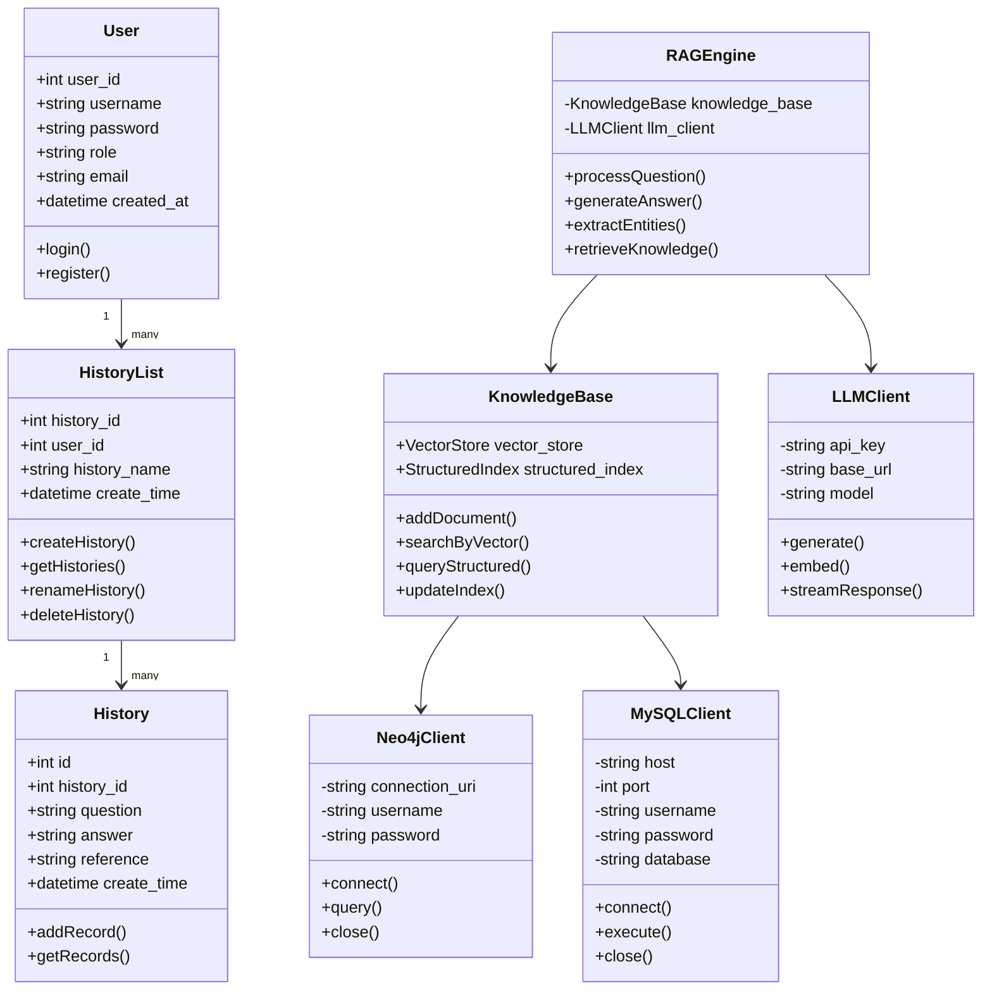
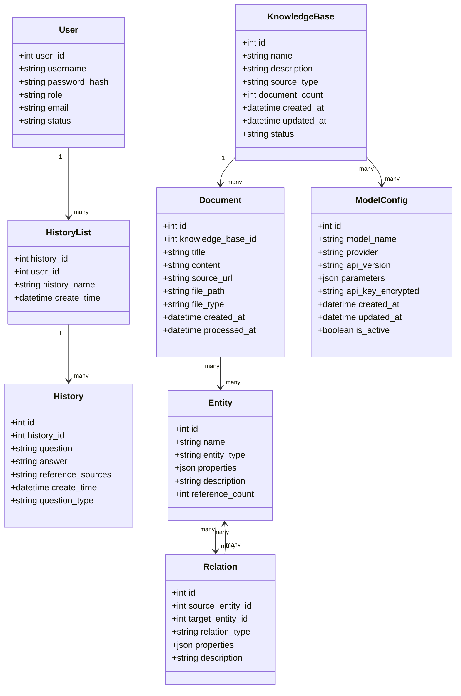
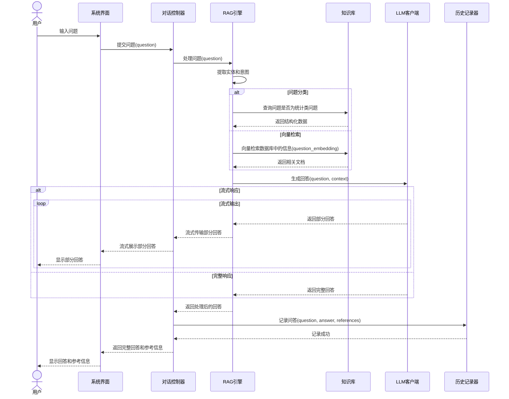
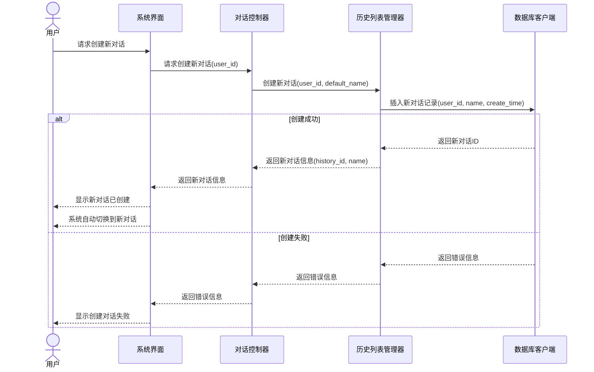

# _____ 需求规格说明书

## 1. 引言

### 1.1 编写目的

该文档是关于用户对于 _______博物馆知识问答系统的功能和性能的要求，重点描述了系统的功能需求。

系统的主要目的是为了连接古今、解码文明，为用户提供专业而富有诗意的博物馆文物知识与解读。这一系统的开发成功，解决了传统博物馆知识获取方式单一、深度有限的现状。无论是在知识查询、多轮对话、智能问答等方面都可以帮助用户最迅速最准确地获取所需的博物馆知识。无论是在适用性、灵活性和易操作性方面都显示出了它的强大功能。

通过这份软件产品需求分析报告详尽说明了该软件产品的需求规格，从而对该软件产品进行准确的定义。

### 1.2 预期读者

本软件产品需求分析报告预期读者：

- 项目负责人、产品经理
- 前端开发人员、后端开发人员、算法工程师
- 测试人员、运维人员
- 文物领域专家、知识库维护人员
- 平台管理人员

### 1.3 产品范围

#### 1.3.1 待开发软件系统

待开发软件系统：基于 B/S 结构的博物馆知识问答系统 _______

#### 1.3.2 产品说明

_______作为一种现代化的博物馆知识服务系统，是博物馆数字化转型的重要组成部分。

_______的应用将使博物馆知识服务工作智能化、个性化、高效化，避免知识检索的片面性，提高信息处理的速度和准确性，能够及时、准确、有效地回答用户关于博物馆文物的各类问题。

系统的主要功能是为了方便用户查询博物馆文物信息、了解文物特点、作者、年代等属性，提高博物馆知识传播的效率与深度。

### 1.4 参考文献

- 
- 
- 
- 
- 
- 

---

## 2. 综合描述

本项目是为博物馆和文物爱好者开发的智能知识问答系统。随着人工智能和大语言模型技术的发展，博物馆知识服务需要向智能化、个性化方向发展。在计算机和人工智能高速发展的时代，使用户可以便捷获取专业的博物馆知识，提升文化体验。

现在博物馆采用的基本都是传统的展板展示或简单的语音讲解，无法满足用户深度了解文物知识的需求。本系统是基于 BS 结构开发的，采用 MySQL 和 Neo4j 作为后台数据库，采用标准的 Web 架构（Flask-Python）开发模式。系统集成了先进的 RAG（检索增强生成）技术和大语言模型，提供了高准确度、高相关性的问答服务。

在使用本系统时，用户不需安装任何的客户端软件，只要用户的设备上有浏览器就可以进行操作，所有的数据处理都是由服务器完成的。

### 2.1 产品的功能

1. 用户认证与授权
2. 多轮对话管理
3. 博物馆文物知识问答
4. 文物属性查询（作者、年代、特点等）
5. 统计类问题解答
6. 对话历史管理
7. RAG 增强回答

### 2.2 用户类和特性

| 用户类型 | 主要特征 | 主要权限 |
| :-- | :-- | :-- |
| 普通用户 | 使用系统进行文物知识查询和学习 | 提问、查看回答、管理个人对话历史 |
| 研究人员 | 关注知识准确性、来源和关联分析 | 深度查询、查看参考来源、提交纠错建议 |
| 管理员 | 负责系统运行和内容管理 | 用户管理、知识库维护、模型配置、数据审核 |
| 领域专家 | 负责文物知识校验和专业审核 | 知识审核、反馈处理、内容修订建议 |

### 2.3 运行环境

本系统采用 B/S 结构开发，硬件配置主要包括客户端硬件和服务器端硬件的选择。硬件的配置要求要根据用户对系统的稳定性要求、系统的容量、系统的吞吐量，以及用户维护水平来确定。

#### 硬件平台

##### 客户端

- 普通 PC 或移动设备
- CPU：双核处理器或更高
- 内存：4GB 或更高
- 分辨率：1280×720 或更高

##### 服务器端

- CPU：8 核或以上
- 内存：16GB 或以上
- 硬盘：500GB 或以上

#### 操作系统和版本

- Windows 2008 或以上版本

#### 支撑环境和版本

- 数据库：MySQL 5.7 或以上
- 图数据库：Neo4j 4.4 或以上
- Python 3.9 或以上
- Flask 2.0 或以上
- OpenAI API 支持
- 向量数据库：Milvus 2.0 或以上

### 2.4 设计和实现上的限制

#### 1. 必须使用的特定技术、工具、编程语言和数据库 (待修改)

- Python Flask 框架
- MySQL 关系型数据库
- Neo4j 图数据库
- Milvus 向量数据库
- 大语言模型 API

#### 2. 运行限制

- 需要稳定的互联网连接
- 需要配置合适的 API 密钥
- 需要足够的存储空间用于向量索引
- 响应时间应控制在合理范围内

---

## 3. 系统功能需求

### 3.1 系统工作流程分析

1. 用户登录系统，可以创建新对话或查看历史对话。
2. 用户输入问题，系统首先尝试从问题中提取实体和属性。
3. 如果成功提取，系统尝试使用 Neo4j 图数据库查询相关信息。
4. 如果图数据库查询成功，系统直接返回结构化知识。
5. 如果上述步骤失败，系统使用 RAG 增强功能：
   - 首先对问题进行分类。
   - 如果是统计类问题，使用结构化索引处理。
   - 否则，使用向量检索找到相关知识。
   - 将检索到的知识与用户问题结合，调用大语言模型生成回答。
6. 如果 RAG 增强也失败，系统直接使用大语言模型生成回答。
7. 系统记录问答历史，供用户后续查看和继续对话。

#### 3.1.1 系统工作流程图

---

### 3.2 系统用例分析

#### 3.2.1 系统用例图

#### 3.2.2 主要用例

主要用例包括：

1. 用户登录
2. 创建新对话
3. 查看历史对话
4. 提问问题
5. 查看回答
6. 重命名对话
7. 删除对话

---

### 3.3 系统类图及实体类属性

#### 3.3.1 类图 (根据最终的数据库修改)

#### 3.3.2 主要类

主要类包括：

1. `User` - 用户类
2. `HistoryList` - 对话历史列表类
3. `History` - 具体对话历史类
4. `RAGEngine` - 检索增强生成引擎类
5. `KnowledgeBase` - 知识库类
6. `Neo4jClient` - Neo4j 客户端类
7. `MySQLClient` - MySQL 客户端类
8. `LLMClient` - 大语言模型客户端类

#### 3.3.3 系统实体关系类图

#### 3.3.4 系统类属性

主要类属性：

1. `User`：`user_id`、`username`、`password`、`role`
2. `HistoryList`：`history_id`、`user_id`、`history_name`、`create_time`
3. `History`：`id`、`history_id`、`question`、`answer`、`reference`、`create_time`
4. `RAGEngine`：`knowledge_base`、`llm_client`
5. `KnowledgeBase`：`vector_store`、`structured_index`
6. `Neo4jClient`：`connection_uri`、`username`、`password`
7. `MySQLClient`：`host`、`port`、`username`、`password`、`database`
8. `LLMClient`：`api_key`、`base_url`、`model`

---

### 3.4 用例描述

#### 表 3.4.1 “提问问题”用例描述

| 项目 | 内容 |
|---|---|
| 用例名 | 提问问题 |
| 用例编号 | UC101 |
| 简要描述 | 用户通过该用例向系统提交问题，获取答案。 |
| 参与者 | 用户 |
| 涉众 | 用户：完成问题提交。 系统：处理问题并生成回答。 |
| 相关用例 | 创建对话、查看历史对话 |
| 前置条件 | 用户已登录系统并且已创建或选择一个对话。 |
| 后置条件 | 系统生成回答并保存问答记录。 |
| 基本事件流 | 1. 用户输入问题并提交 2. 系统处理问题并生成回答 3. 系统显示回答给用户 4. 系统保存问答记录到历史表 |
| 备选事件流 | A-1 系统无法生成回答 1. 系统提示无法回答该问题 2. 用户可以重新提问或结束用例 |
| 补充约束 | B-1 问题不能为空 B-2 问题长度不应超过 1000 字符 B-3 系统应在合理时间内返回回答 |
| 待解决问题 | 无 |

#### 表 3.4.2 “查看历史对话”用例描述

| 项目 | 内容 |
|---|---|
| 用例名 | 查看历史对话 |
| 用例编号 | UC102 |
| 简要描述 | 用户通过该用例查看历史对话内容。 |
| 参与者 | 用户 |
| 涉众 | 用户：查看历史对话内容。 |
| 相关用例 | 提问问题、创建对话 |
| 前置条件 | 用户已登录系统且有历史对话记录。 |
| 后置条件 | 系统显示历史对话内容。 |
| 基本事件流 | 1. 用户选择一个历史对话 2. 系统获取该对话的所有问答记录 3. 系统按时间顺序展示问答内容 |
| 备选事件流 | A-1 没有查询到历史记录 1. 系统提示没有历史对话记录 2. 用户可以创建新对话或结束用例 |
| 补充约束 | B-1 系统应支持分页显示历史记录 B-2 系统应显示问答时间信息 |
| 待解决问题 | 无 |

---

### 3.5 系统处理功能分析

#### 3.5.1 提问用例顺序图(根据最终功能修改)

#### 3.5.2 创建对话顺序图

---

## 4. 其它非功能需求

### 4.1 界面需求

1. 页面内容：主题突出、操作方便、术语和行文格式统一、规范、明确。每一个系统用户拥有事先分配好的用户名和密码，不同类型的用户只能访问各自工作领域内的相关页面。
2. 页面结构摆放合理，方便用户使用。
3. 技术环境：页面大小适中，响应式设计，适应不同设备屏幕。
4. 界面应支持流式输出回答，提供良好的用户体验。

### 4.2 响应时间需求

用户登录，进行任何操作的时候，系统应该及时地进行反应，对于简单查询，反应的时间应在 3 秒以内；对于复杂问题的回答，首字输出应在 5 秒内开始。

系统应能检测出各种非正常情况，如与设备的通信中断，无法连接数据库服务器等，以避免出现长时间等待甚至无响应。

### 4.3 可靠性需求

本系统是在 Internet 上进行服务的，主要的系统数据都要通过 Internet 在客户端和服务器之间进行传输，这样就很难保证系统信息不会遭到恶意的破坏，这就需要我们要尽量的对数据进行加密保护。

另一方面，本系统是一个多用户系统，这就有管理员和普通用户的区分，这也需要我们在系统中对不同人员的使用权限进行区分，不同的使用人员所能访问的资源是不同的。这两方面就保证了系统的可靠性。

### 4.4 开放性需求

系统应具有较强的灵活性，以适应将来功能扩展的需求。尤其是在知识库扩展、模型升级、新功能添加方面，应具备良好的开放性。

### 4.5 可扩展性需求

一个系统在被使用了一段时间后，使用者都会对系统提出很多的改进意见，这就要求我们编写的系统要有很好的可扩展性。

本系统由于是采用模块化设计，所以当用户提出改进意见后，开发人员只需要在服务器端把相应的模块改写或添加新模块，就会改变系统中相应部分的功能。

系统应支持：

1. 新知识来源的扩展
2. 新 LLM 模型的集成
3. 新检索算法的接入
4. 新博物馆资源的添加

### 4.6 系统安全需求

系统需要严格的权限管理功能，各功能模块需要相应的权限方能进入。系统需能够防止各类误操作能造成的数据丢失、破坏。防止不法用户盗取重要信息。特别是 API 密钥等敏感信息需要严格保护，避免泄露和滥用。